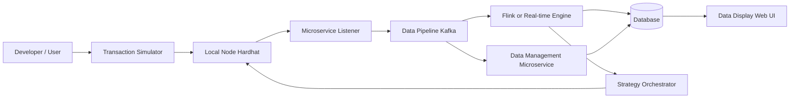

```mermaid
flowchart LR
    A[Developer / User] --> B[Transaction Simulator]
    B --> C[Local Node Hardhat]

    C --> D[Microservice Listener]
    D --> E[Data Pipeline Kafka]
    E --> F[Flink or Real-time Engine]
    E --> G[Data Management Microservice]

    F --> H[(Database)]
    G --> H[(Database)]

    F --> I[Strategy Orchestrator]
    I --> C[Local Node Hardhat]

    H --> J[Data Display Web UI]
```