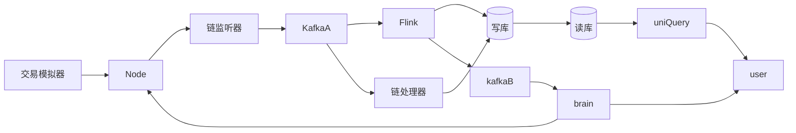
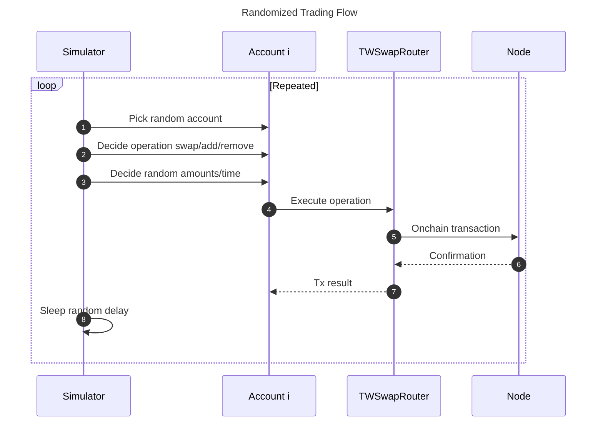
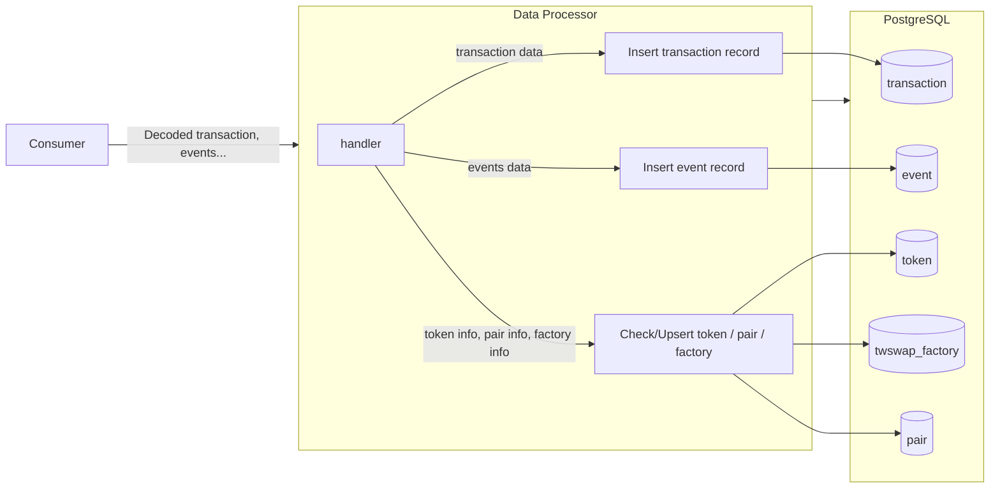
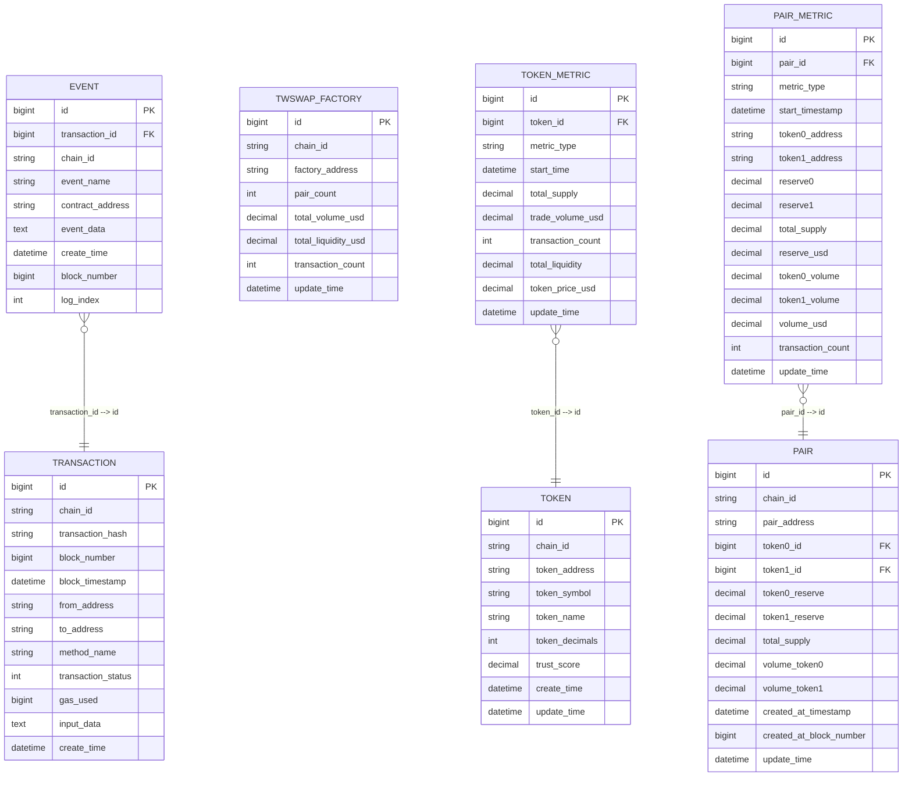
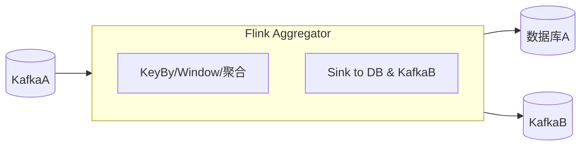

# defi数据服务平台
## 系统整体设计

主要目标：**通过链上数据分析帮助用户发现机会并规避风险**。
业务分解：1.链上数据获取 2.链上数据处理 3.数据服务（大盘展示，事件通知），4.决策中心（通过事件与预设规则把控系统运行） 
### 核心模块
1. **交易模拟器（simulator）**：在本地 Hardhat 节点中模拟多账户多场景的 Uniswap V2 交易和流动性操作，持续提供数据流。
2. **链监听器(listener)**：监听本地节点，将链原生数据格式转化成规定消息格式后，推送到消息队列。
3. **链处理器（processor）**：消费指定消息流，转换成规定格式，写入数据库A（写库）
4. **链聚合器（aggregator）**：消费指定消息流，进行窗口计算，sink到数据库A及消息队列
5. **CQRS同步器（synchronizer）**：使用CQRS模式将数据库A数据映射到数据库B（读库）
6. **统一查询器(uniQuery)**，为前端提供统一查询服务，以可视化方式呈现交易趋势、流动性风险等。
7. **决策大脑(brain)**：整个系统的调控中心，目前需求功能：接入事件（链上事件、用户事件），根据预设的策略编排（DAG）进行节点调度

### 项目约定
1.～ ：项目顶层目录 2.链合约部署信息位于～/deployment.json 3.相同含义字段名称统一，比如只使用transactionHash而不使用txHash，如果外部依赖命名与系统约定不一致，转换成系统约定。4.数据库表结构我放到 TableStructure.md

### 数据流图



## 交易模拟器
	1.	目标：在本地节点中模拟多账户、多 Token、多场景的交易，目前聚焦 Uniswap V2 （如添加或移除流动性、swap），为后续分析提供丰富数据。
	2.	主要组成
	•	Accounts：5 个本地账户，每个账户拥有足量测试 Token，并持续发起交易。
	•	Tokens：通过最小代理部署 5 个 MyERC20（WETH、USDC、DAI、TWI、WBTC）。给各账户 mint 大量代币。
	•	TWSwap：自实现的Uniswap V2（包含 Factory、Router、Pair），可处理 add/remove 流动性、swap。
	•	初始化脚本：部署合约、创建交易对并添加初始流动性，把合约地址写入deployment.json。
	•	模拟器循环：随机或脚本化地对 TWSwapRouter 发起多样化交易（addLiquidity、removeLiquidity、swap），生成持续事件流供后续处理。

### 流程图


## 链监听器
流程：
1. 使用 go-ethereum 的 ethclient 连接 http://127.0.0.1:8545，监听区块及拉取日志。
2. 解析链数据，聚合成transaction维度，发送到 Kafka（Topic: chain_transactions）。
### Kafka 消息定义 
```json
{    "transaction": {
      "type": "object",
      "properties": {
        "blockNumber": { "type": "integer" },
        "blockHash":   { "type": "string" },
        "timestamp":   { "type": "integer" },
        "transactionHash": { "type": "string" },
        "transactionIndex":{ "type": "integer" },
        "transactionStatus":      { "type": "string" },
        "gasUsed":     { "type": "integer" },
        "gasPrice":    { "type": "string" },
        "nonce":       { "type": "integer" },
        "fromAddress":        { "type": "string" },
        "toAddress":          { "type": "string" },
        "transactionValue":       { "type": "string" },
        "inputData":   { "type": "string" },
        "chainID":     { "type": "string" }
      },
      "required": ["blockNumber","transactionHash","fromAddress","toAddress","chainID"]
    },
    "events": {
      "type": "array",
      "items": {
        "type": "object",
        "properties": {
          "eventName": { "type": "string" },
          "contractAddress": { "type": "string" },
          "logIndex":  { "type": "integer" },
          "blockNumber": { "type": "integer" },
          "topics":    {
            "type": "array",
            "items": { "type": "string" }
          },
          "eventData":      { "type": "string" },
          "decodedArgs": { "type": "object" }
        },
        "required": ["eventName","contractAddress","logIndex"]
      }
    }
  }
}
```
## 数据处理与数据库写入


## ER图

trust_score先为0

## 链聚合器
使用java作为开发语言
订阅Topic：
	•	解析每条消息，按特定分组维度 KeyBy（如 tokenAddress/pairAddress 等）。
	•	应用时间窗口（基于事件时间或处理时间），完成聚合计算。
	•	计算出的汇总指标（如交易量、流动性）或统计信息写回：
	•	数据库 A（如 PAIR_METRIC, TOKEN_METRIC 等表）。
	•	也可发送聚合结果到 KafkaB，以触发下游决策逻辑（脑 brain）或进一步的数据消费。

### 需求与指标说明
	1.	Token 级别（TOKEN_METRIC）
	•	交易数量(transaction_count)
	•	交易量（USD）(trade_volume_usd)
	•	总流动性(total_liquidity)
	•	Token 价格(token_price_usd)
	•	时间粒度：可按 1 分钟、5 分钟、1 小时、1 天等窗口输出。
	•	更新时间：与窗口结束时间一致；或实时更新最新统计。
	2.	交易对（PAIR）级别（PAIR_METRIC）
	•	交易数量(transaction_count)
	•	交易量（volume_usd） & 各 Token 的交易量(token0_volume, token1_volume)
	•	reserve0, reserve1(储备量)
	•	reserve_usd(储备总价值)
	•	total_supply(LP Token 总量)
	•	时间粒度：同上，按需求设定窗口大小。
### 聚合计算设计

1. 基于事件时间 (Event Time)：以链上区块时间 timestamp 为准时计算窗口; Flink 配置正确的水位线 (Watermark)。
2. 窗口类型：滑动窗口 （窗口大小30s,5min,30min，滑动时间：窗口大小的1/5）
3. 使用单个flink job
指标计算示例

以Pair 维度聚合为例，可能的计算步骤：
	1.	Parse：对每条 Kafka 消息提取 blockTimestamp, transactionHash, pairAddress, amount0, amount1, amountUSD 等核心字段。
	2.	KeyBy(pairAddress)。
	3.	Aggregate Function：
	•	transaction_count：窗口内消息条数累加。
	•	volume_token0, volume_token1：对相应金额累计求和。
	•	volume_usd：对 amountUSD 累加。
	•	其他可根据需求进行求平均、最值或其他运算。
