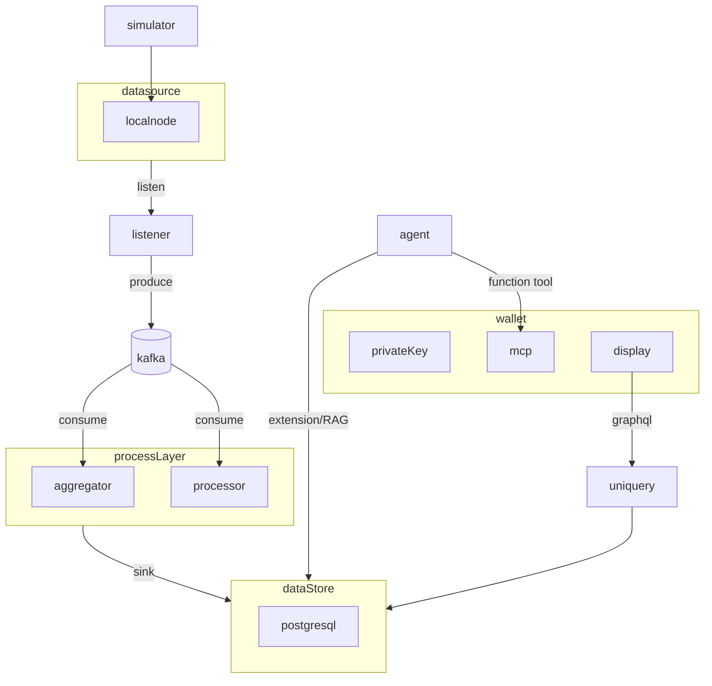
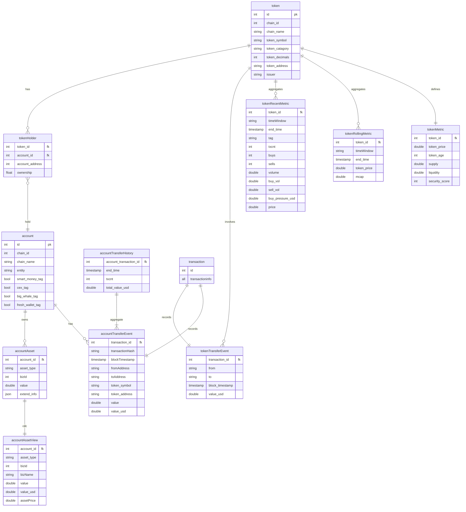
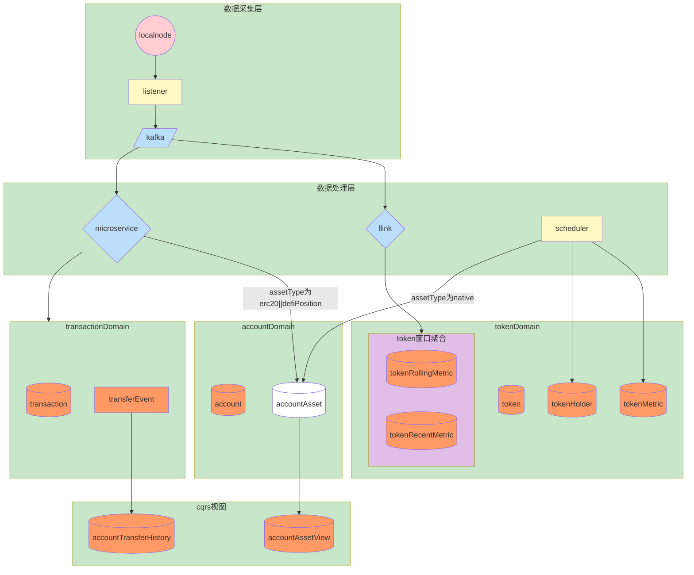
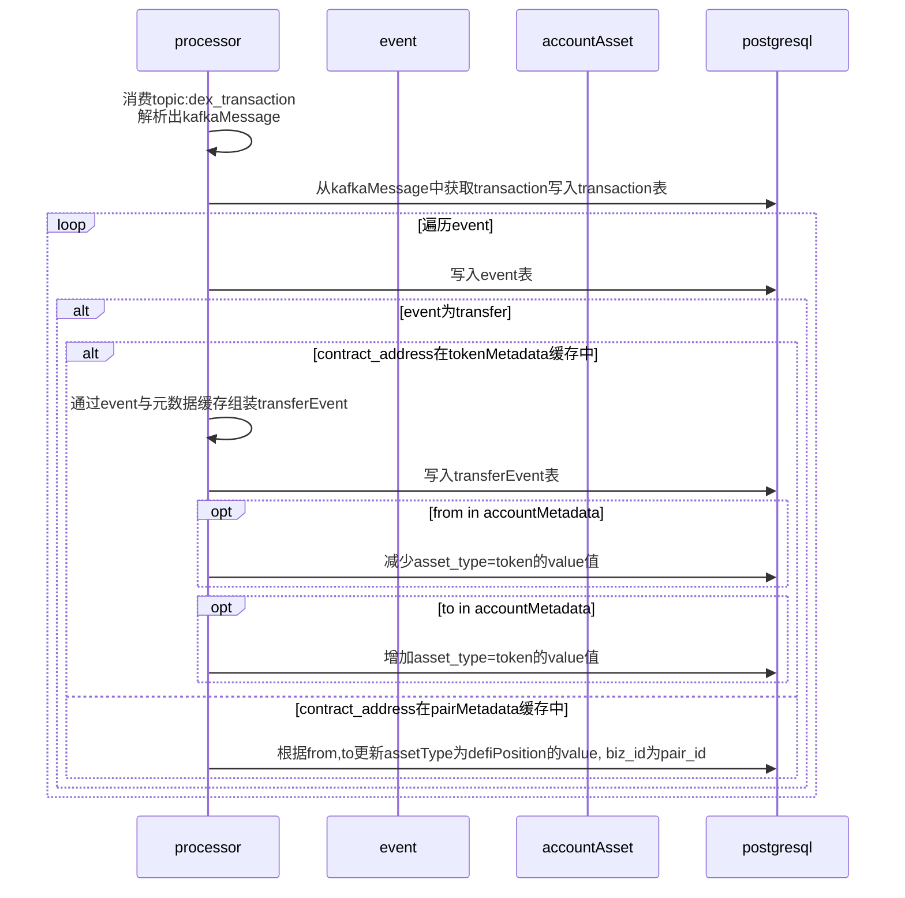
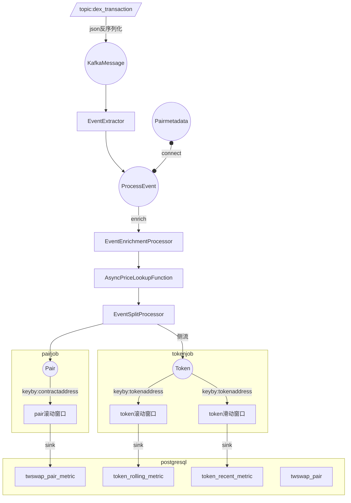
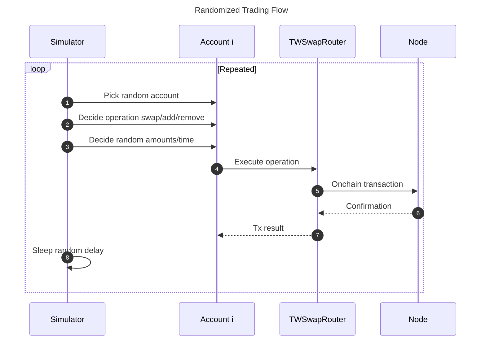
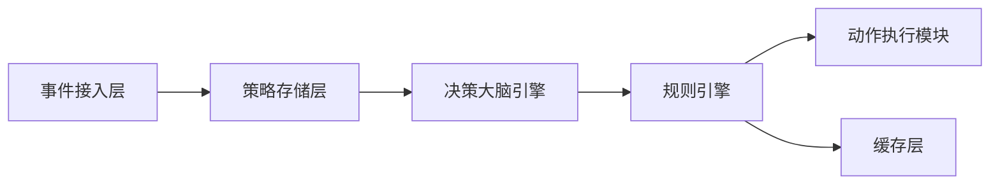
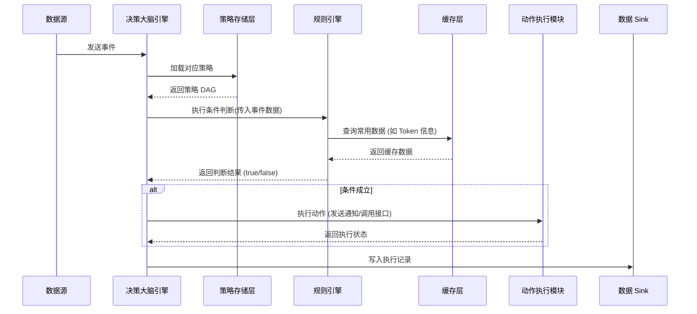
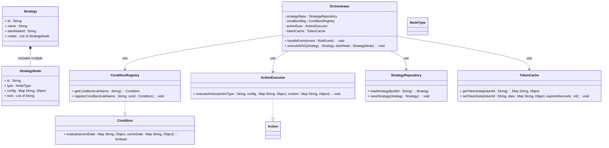

# 系统整体设计 
项目名称：基于ai智能体的加密货币自动投资系统（MVP）
主要工作流：在本地节点模拟链上交易，监听本地node数据，实时处理后作为agent输入并进行大盘展示，
ps:本文档为给agent参考的唯一信任源，略凌乱。
## 

## 核心模块
1. **交易模拟器（simulator）**：在本地 Hardhat 节点上模拟多账户多场景的链上操作，为其他模块提供持续数据流。
2. **数据接入模块(listener)**：接入并管理外部数据源，数据格式标准化写入消息队列。
3. **处理器（processor）**：数据处理微服务，消费标准化后的消息，处理后写入数据存储。
4. **聚合器（aggregator）**：使用flink聚合标准化消息流，sink到数据库或消息队列
5. **查询器(uniquery)**，为前端提供查询服务，以可视化方式呈现交易趋势、dex流动性等。
6. **智能体（agent）**：基于推理模型及大模型进行决策，通过工具执行链上操作。
## 主要原理图 
### 整体业务流程


### 数据模型


### 数据流图


## 项目约定
1. 链合约部署信息位于 deployment.json 
2. 相同含义字段名称统一，比如只使用transactionHash而不使用txHash，如果外部依赖命名与系统约定不一致，转换成系统约定。
3. 使用usdc作为唯一美元价格锚定，代币价格为与usdc交易对价格
4. 使用项目根目录的docker-compose.yml作为唯一docker容器

### 指标命名规则

指标全名唯一，对应唯一当前值指标由以下四部分组成： `{scope}_{metrictype}_{unit}_{interval}`

- **scope**: 指标作用域，可由多部分组成，如eth_uni2_pair
- **metrictype**: 指标类型，如volume, liquidity, txcnt
- **interval**: 窗口时间，如20s, 1min, 1h，省略则代表总量
- **unit**: 单位，如usd，可根据共识省略，如次数

# 数据接入模块
目标：接入并管理外部数据源，数据格式标准化写入消息队列。
主要模块：数据监听器，数据标准化器，链重组处理器。
## 数据监听器
目标：接入并管理外部数据源
主要组件：
1. 监听方法：目前只有轮询 
   1. 后续扩展：websocket,实时消息
2. 数据源：表示具体数据源
   1. 目前只有本地node :  使用 go-ethereum 的 ethclient 连接http://127.0.0.1:8545，监听区块及拉取日志。
   2. 后续扩展：数据提供商api 如CoinMarketCap ，爬虫数据，cex api, 社交平台：如Twitter API.
3. 数据源注册器：注册管理数据源生命周期
## 数据标准化器
目标：对多数据源数据统一标准化为内部格式
目前实现：链上dex交易数据解析。
## 生产者
目标：将标准化的数据推送到kafka
目前：dex交易数据：topic dex_transaction
## 链重组处理器
**记录区块信息**：保存已处理区块的哈希值及其父区块哈希。
**检测重组信号**：当接收到新区块时，检查其父区块哈希是否与系统中记录的最新区块哈希一致。如果不一致则表明发生了链重组
**重组通知：**推送一条消息到Kafka的reorg-events Topic，内容包括废弃区块范围（如高度100-105）和新区块范围（如高度100’-106’）。
## 代码示例
```go
// 核心接口
type DataSource interface {
    Start(context.Context) error
    Stop() error
}

// 连接策略抽象
type ConnectionMethod interface {
    Connect() error
    Fetch() (Data, error)
    Close() error
}
//数据源注册
type Registry struct {
    sources map[string]DataSource
    mu      sync.RWMutex
}

func (r *Registry) Register(id string, source DataSource) error {
}
//数据标准化
type Normalizer interface {
    Normalize(Data) (NormalizedData, error)
}

// 具体标准化实现
type DexTransactionNormalizer struct{}

func (n *DexTransactionNormalizer) Normalize(d Data) (NormalizedData, error) {
}
```

# 链处理器
### 时序图



**说明：**
<!-- 
当transfer代表mint lptoken时，只记录新mint的lptoken数，待transaction中的sync事件时进行balance与average_price统一更新

平均注入价格更新逻辑 ：（oldBalance*average_price+liqudityDelta*(reserve0/reserve1))/(liqudityDelta+oldBalance)，reserve0/reserve1从sync事件中获取 -->

# 链聚合器
目的：按窗口聚合链上数据生成指标。
语言：java
框架: flink
数据源：kafka topic :dex_transaction
## 流程图



## 算子

### EventExtractor

类型：FlatMapFunction

遍历并处理KafkaMessage的event列表生成ProcessEvent流

### EventEnrichmentProcessor

类型：BroadcastProcessFunction

为ProcessEvent增加pair元数据，Pairmetadata从twswap_pair表中获取
为ProcessEvent增加fromAddressTag，从account表中获取，只会有1个tag为t,其余为f

### AsyncPriceLookupFunction

类型：RichAsyncFunction

查询redis，enrich ProcessEvent

为ProcessEvent增加token0，token1 price, fromAddressTag,从redis查询 

**1.token0,token1 price**

key: token_price:{address} 

### EventSplitProcessor

类型：ProcessFunction

如果event 是 Swap，Sync,Mint,Burn则添加相关参数生成pair流

如果event 是 Swap，还要为token0,token1添加相关参数输出到token侧流

stream:Transaction--flatmap -->stream:Event时将fromAddress写入Event方便后面处理获取。

## Token窗口

采用滑动窗口与滚动窗口，每种窗口有多个聚合时间：20s,1min,5min,1h

### sink

滚动窗口:token_rolling_metric

滑动窗口token_recent_metric

### 窗口计算优化

为了避免重复计算采用层级化窗口处理，先聚合最小时间粒度(20s)的窗口，高层级根据低层级聚合结果进行计算。

### 指标计算

**volume类**

- **volume_usd**+= amount*tokenPriceUsd
- **buy_volume_usd**+= buyOrSell==true?amount*tokenPriceUsd:0
- **sell_volume_usd**+=buyOrSell==false?amount*tokenPriceUsd:0
- **buy_pressure_usd**= buy_volume_usd-sell_volume_usd

**count类:**

- txcnt++
- buy_count : if buyOrSell==true ,buy_count++
- sell_count: if buyOrSell==false,sell_count++

**token滑动窗口**

先聚合最小时间粒度(20s)的窗口结果，以20s为滑动步长,高层级窗口以20s聚合结果进行增量聚合。

按tag聚合:除了全量聚合外，按照token流中tag标签进行聚合，对应表中tag字段。tag从

### 状态

MapState<String,TokenRecentMetric> 20sMetricHistory

key:timestamp+_+tag, 存储20s窗口的历史值,状态保留时间：70分钟

MapState<String,TokenRecentMetric> recentMetric

key: {”1min”,”5min”,”1h”}+_+tag,存储高层级窗口上一次聚合值

### 增量聚合逻辑

若当前时间戳为t,窗口宽度为p

newMetric=20sMetricHistory(t)-20sMetricHistory(t-p)+recentMetric

## pair处理

keyBy:contractAddress

多个滚动时间窗口，窗口时间为20s,1min,5min,1h

## tokenPriceUsd

以twswap_pair表中各token 与usdc的pair的reserve比值为usd价格,usdc价格为1。reserve从twswap_pair_metric最新的数据获取

比如weth是token0,usdc是token1,weth的tokenPriceUsd为token1_reserve/token0_reserve，反之同理

redis key:tokenAddress value:tokenPriceUsd

### 指标计算

下面指标为窗口期累加值，初始值为0：

- token0_volume_usd
- token1_volume_usd
- volume_usd
- txcnt

下面指标在窗口内更新值：

- token0_reserve
- token1_reserve
- reserve_usd

**事件处理逻辑**

### Sync:

- 更新 token0_reserve, token1_reserve，如果token中包含usdc,则更新redis中pair另一种token的tokenPriceUsd
- 计算并更新 reserve_usd = token0_reserve * token0PriceUsd + token1_reserve * token1PriceUsd
- 增加 txcnt

### Swap:

- 更新 token0_volume_usd += amount0In * token0PriceUsd + amount0Out * token0PriceUsd
- 更新 token1_volume_usd 同理
- 增加 txcnt

### Mint/Burn:

- 仅增加 txcnt

# 交易模拟器
	1.	目标：在本地节点中模拟多账户、多 Token、多场景的交易，目前聚焦 Uniswap V2 （如添加或移除流动性、swap），为后续分析提供丰富数据。
	2.	主要组成
	•	Accounts：5 个本地账户，每个账户拥有足量测试 Token，并持续发起交易。
	•	Tokens：通过最小代理部署 5 个 MyERC20（WETH、USDC、DAI、TWI、WBTC）。给各账户 mint 大量代币。
	•	TWSwap：自实现的Uniswap V2（包含 Factory、Router、Pair），可处理 add/remove 流动性、swap。
	•	模拟器循环：随机或脚本化地对 TWSwapRouter 发起多样化交易（addLiquidity、removeLiquidity、swap），生成持续事件流供后续处理。

## 流程图

# 决策大脑

决策大脑系统旨在对外部事件进行处理，根据预先配置的策略（以 DAG 形式定义）动态判断和执行动作。系统具有以下通用目标：
•	接收来自不同数据源（例如链上数据、实时聚合结果、增量数据库更新）的事件。
•	根据预设规则判断事件是否满足条件，并沿着策略 DAG 流程依次执行。
•	通过条件判断模块与动作执行模块，实现对风险、机会或通知等动作的自动化处理。
•	支持动态规则更新和缓存优化（例如 Redis 缓存常用数据），以提升实时响应能力。
**2. 整体架构**
系统主要分为以下模块：
•	**事件接入层**
负责从外部数据源（例如消息队列、增量数据库等）接收事件，并转换为内部统一格式。
•	**策略存储层**
保存策略配置（DAG），包括各节点（条件、动作、延时等）的定义与关联关系。
•	**规则引擎**
在条件节点中，根据预设规则及外部数据（可包含缓存数据）判断条件是否成立。
该模块通过接口定义和注册机制实现可扩展性和动态更新。
•	**决策大脑引擎**
接收到事件后，从策略存储中加载相应策略，通过遍历 DAG 按顺序执行条件、动作节点，管理状态及延时调度。
•	**动作执行模块**
根据条件判断结果，执行实际动作（例如发送通知、调用外部接口或写入下游系统）。
•	**缓存层**
对常用数据（如 Token 信息等）进行缓存，采用 Redis 等方案以加速规则引擎的查询，支持设置合理过期时间以确保数据实时性。
•	**数据 Sink**
将策略执行结果、事件聚合统计写入数据库或消息队列，供后续监控和决策使用。
下图描述了系统整体模块之间的数据流和交互关系。

**3. 数据流程**
1.	**事件接入**
外部系统（例如链聚合器、实时数据平台或数据库 CDC）将事件转换为统一格式后，通过消息队列送入决策大脑系统。
2.	**策略加载与执行**
决策大脑引擎接收到事件后，根据事件类型和其他上下文信息，从策略存储中加载对应策略（DAG），并开始遍历各节点。
3.	**条件判断**
对于条件节点，编排引擎调用规则引擎进行判断。规则引擎从缓存层（例如 Redis）获取常用数据，并根据预设规则（例如判断特定指标是否超过阈值）返回判断结果。
条件规则可以是简单的比较，也可以通过复合规则组合多个条件。
4.	**动作执行**
当条件判断成立时，决策大脑引擎进入动作节点，调用动作执行模块完成具体操作（例如发送用户通知或调用外部接口），并将执行状态反馈给编排引擎。
5.	**数据存储**
最终的策略执行结果和衍生事件写入数据库或消息队列，以便离线分析、监控与后续决策。
**4. 时序图**
下面的时序图展示了从事件输入到条件判断、动作执行及结果反馈的基本流程。

**说明**：
•	当决策大脑引擎接收到外部事件后，从策略存储加载策略 DAG，并通过规则引擎判断条件是否成立。
•	规则引擎在判断过程中可能访问缓存层（如 Redis）以加速查询。
•	若条件成立，则调用动作执行模块，最后将结果写入数据库或消息队列。
**5. 类图**
下面的类图展示了决策大脑系统中核心类及其关系。图中各模块之间接口清晰，支持动态扩展与缓存优化。

**说明**：
•	**Orchestrator** 是系统的核心入口，负责接收事件、加载策略、遍历 DAG 并调用条件和动作模块。
•	**Strategy** 和 **StrategyNode** 定义了策略的基本结构，DAG 节点可以为条件、动作、延时等不同类型。
•	**ConditionRegistry** 管理所有条件规则的实现，提供动态扩展能力。
•	**ActionExecutor** 负责实际动作执行，如发送通知或调用外部接口。
•	**TokenCache** 封装 Redis 操作，用于缓存 Token 表中的数据（如 chain_id、hype_score 等），并设置合理过期时间保证数据实时性。
•	**StrategyRepository** 负责加载和保存策略配置。
**6. 关键实现说明**
•	**数据接入**：
系统从外部数据源（例如 Postgres 增量数据、CDC 流）获取 token_metric 数据，用于计算买盘压力（buy_pressure）；同时从 token 表中获取 chain_id 和 hype_score。
这些数据可由实时计算系统（例如 Flink）聚合后写入数据库，或直接通过消息队列传递给决策大脑系统。
•	**缓存优化**：
Token 数据存入 Redis 缓存，TokenCache 提供查询接口。由于 hype_score 变化较快，设置TTL 1 分钟确保数据实时性。
•	**规则判断**：
条件节点调用 ConditionRegistry 注册的条件实现，例如判断：
•	token 表中 chain_id 是否等于 31337
•	token_metric 中 buy_pressure 是否大于 1000 USD
•	token 表中 hype_score 是否大于 70
当所有条件满足时，规则判断返回 true，触发后续动作。
•	**动作执行**：
若条件满足，决策大脑引擎通过 ActionExecutor 触发用户通知或其他动作。此处动作可以写入 Kafka 通知 Topic 或调用外部 API。
•	**策略流程**：
以 DAG 形式存储策略，每个节点具有类型和配置，支持条件判断、动作执行、延时等待等。整个流程在 Orchestrator 内部串联，实现动态化、可扩展的自动决策。
## 规则引擎
本规则引擎用于为决策大脑系统提供动态规则判断功能。系统通过加载外部 JSON 格式的配置文件，根据业务类型（bizType）筛选出一组 Condition（条件）规则，并并发调用每个 Condition 类的 Evaluate 方法，对传入的业务数据进行判断，返回命中的规则列表。该规则引擎分为以下几个核心模块：
	•	触发层：Orchestrator 加载配置文件，根据 bizType 筛选条件列表，并发调用各 Condition 的 Evaluate 方法；
	•	Condition 类：每个 Condition 包含多个 SubCondition 与一个 CompositeOperator（AND/OR），其 Evaluate 方法接收 bizType 与业务数据，返回判断结果 true/false；
	•	SubCondition 类：代表单个原子规则，定义一个 metric、一个运算符（>, <, =）和一个阈值；
	•	业务 Metric 获取类：针对每个 bizType，提供获取相关指标（metric）的方法，这些指标可以从数据库、缓存或直接从业务数据中获得；
	•	配置文件：以 JSON 文件保存所有条件规则配置，支持根据 bizType 筛选不同的规则组合。


# 查询器 (UniQuery)

UniQuery 是为前端提供查询服务的模块，以可视化方式呈现交易趋势、代币信息、账户信息等数据。

## GraphQL Schema

### 查询根类型

```graphql
type Query {
  # Account 相关查询
  account(id: ID!): Account
  accounts(page: Int = 1, limit: Int = 10): [Account!]!
  accountTransferEvents(
    accountId: ID!, 
    page: Int = 1, 
    limit: Int = 10, 
    buyOrSell: String, 
    sortBy: String = "blockTimestamp"
  ): [AccountTransferEvent!]!
  accountTransferHistory(
    accountId: ID!, 
    page: Int = 1, 
    limit: Int = 10, 
    buyOrSell: String,
    sortBy: String = "endTime"
  ): [AccountTransferHistory!]!
  
  # Token 相关查询
  token(id: ID!): Token
  tokens(
    page: Int = 1, 
    limit: Int = 10, 
    sortBy: String = "mcap"
  ): [Token!]!
  tokenTransferEvents(
    tokenId: ID!, 
    page: Int = 1, 
    limit: Int = 10, 
    buyOrSell: String,
    onlySmartMoney: Boolean = false,
    onlyWithCex: Boolean = false,
    onlyWithDex: Boolean = false,
    sortBy: String = "blockTimestamp"
  ): [TokenTransferEvent!]!
  tokenHolders(
    tokenId: ID!, 
    page: Int = 1, 
    limit: Int = 10, 
    sortBy: String = "ownership"
  ): [TokenHolder!]!
}
```

### Account 相关类型

```graphql
# 账户详细信息
type Account {
  id: ID!
  entity: String                # 账户所属实体
  labels: [String!]!            # 标签列表，可选值：聪明钱、巨鲸、交易所、fresh account
  chainName: String!
  address: String!
  
  # 余额信息
  ethBalance: Float!
  erc20Balances: [ERC20Balance!]!
  defiPositions: [DefiPosition!]!
  
  # 交易记录列表
  accountTransferEvents(
    page: Int = 1, 
    limit: Int = 10, 
    buyOrSell: String,
    sortBy: String = "blockTimestamp"
  ): [AccountTransferEvent!]!
  
  # 交易历史，按照5分钟聚合且与整点对齐
  accountTransferHistory(
    page: Int = 1, 
    limit: Int = 10, 
    buyOrSell: String,
    sortBy: String = "endTime"
  ): [AccountTransferHistory!]!
}

# ERC20 余额
type ERC20Balance {
  tokenAddress: String!
  tokenSymbol: String!
  balance: Float!
  price: Float!
  valueUSD: Float!
}

# DeFi 持仓信息
type DefiPosition {
  protocol: String!
  contractAddress: String!
  position: String!
  valueUSD: Float!
}

# 单笔交易
type AccountTransferEvent {
  accountId: ID!
  blockTimestamp: String!
  fromAddress: String!
  buyOrSell: String!
  toAddress: String!
  tokenSymbol: String!
  valueUSD: Float!
}

# 转账历史聚合数据（5分钟为单位）
type AccountTransferHistory {
  endTime: String!            # 对应5分钟时间段的结束时间（与整点对齐）
  buyOrSell: String!
  txCnt: Int!
  totalValueUSD: Float!
}
```

### Token 相关类型

```graphql
# 代币信息
type Token {
  id: ID!
  chainName: String!
  tokenSymbol: String!
  tokenAddress: String!
  
  # 详细信息
  tokenDetail: TokenDetail
}

# 代币详细信息
type TokenDetail {
  id: ID!
  # 大盘信息
  chainName: String!
  tokenSymbol: String!
  price: Float!
  mcap: Float!
  liquidity: Float!
  fdv: Float!
  
  # token 额外信息
  issuer: String!
  tokenAge: String!
  tokenCatagory: String!
  securityScore: Float!
  
  # 实时指标（基于不同时间窗口，前端可通过 tab 切换）
  recentMetrics(timeWindow: TimeWindow!): TokenRecentMetric!
  
  # 历史走势数据（柱状图或折线图，时间间隔均为20s，与整点对齐）
  rollingMetrics(
    limit: Int = 100, 
    startTime: String, 
    endTime: String
  ): [TokenRollingMetric!]!
  
  # 交易列表
  tokenTransferEvents(
    page: Int = 1, 
    limit: Int = 10, 
    buyOrSell: String,
    onlySmartMoney: Boolean = false,
    onlyWithCex: Boolean = false,
    onlyWithDex: Boolean = false,
    sortBy: String = "blockTimestamp"
  ): [TokenTransferEvent!]!
  
  # Top Holder 列表
  tokenHolders(
    page: Int = 1, 
    limit: Int = 10, 
    sortBy: String = "ownership"
  ): [TokenHolder!]!
}

# 时间窗口枚举
enum TimeWindow {
  TWENTY_SECONDS
  ONE_MINUTE
  FIVE_MINUTES
  ONE_HOUR
}

# 代币实时指标
type TokenRecentMetric {
  timeWindow: TimeWindow!
  txcnt: Int!
  volume: Float!
  priceChange: Float!          # 窗口前后价格变化
  buys: Int!
  sells: Int!
  buyVolume: Float!
  sellVolume: Float!
  
  freshWalletInflow: Float!
  smartMoneyInflow: Float!
  smartMoneyOutflow: Float!
  exchangeInflow: Float!
  exchangeOutflow: Float!
  buyPressure: Float!
}

# 代币滚动指标
type TokenRollingMetric {
  endTime: String!
  price: Float!
  mcap: Float!
}

# 代币转账事件
type TokenTransferEvent {
  tokenId: ID!
  fromAddress: String!
  toAddress: String!
  valueUSD: Float!
  blockTimestamp: String!
}

# 代币持有者
type TokenHolder {
  accountId: ID!
  tokenId: ID!
  tokenAddress: String!
  ownership: Float!
  valueUSD: Float!
}
```

## 查询示例

### 查询账户信息

```graphql
query GetAccount($id: ID!) {
  account(id: $id) {
    id
    entity
    labels
    chainName
    address
    ethBalance
    erc20Balances {
      tokenAddress
      tokenSymbol
      balance
      price
      valueUSD
    }
    defiPositions {
      protocol
      contractAddress
      position
      valueUSD
    }
  }
}
```

### 查询账户转账事件

```graphql
query GetAccountTransferEvents($accountId: ID!, $page: Int, $limit: Int, $buyOrSell: String, $sortBy: String) {
  accountTransferEvents(
    accountId: $accountId
    page: $page
    limit: $limit
    buyOrSell: $buyOrSell
    sortBy: $sortBy
  ) {
    accountId
    blockTimestamp
    fromAddress
    toAddress
    tokenSymbol
    valueUSD
    buyOrSell
  }
}
```

### 查询账户转账历史

```graphql
query GetAccountTransferHistory($accountId: ID!, $page: Int, $limit: Int) {
  account(id: $accountId) {
    accountTransferHistory(page: $page, limit: $limit) {
      endTime
      buyOrSell
      txCnt
      totalValueUSD
    }
  }
}
```

### 查询代币信息

```graphql
query GetToken($id: ID!) {
  token(id: $id) {
    id
    chainName
    tokenSymbol
    tokenAddress
    tokenDetail {
      price
      mcap
      liquidity
      fdv
      issuer
      tokenAge
      tokenCatagory
      securityScore
      recentMetrics(timeWindow: ONE_MINUTE) {
        timeWindow
        txcnt
        volume
        priceChange
        buys
        sells
        buyVolume
        sellVolume
        freshWalletInflow
        smartMoneyInflow
        smartMoneyOutflow
        exchangeInflow
        exchangeOutflow
        buyPressure
      }
    }
  }
}
```

### 查询代币转账事件

```graphql
query GetTokenTransferEvents($tokenId: ID!, $page: Int, $limit: Int, $buyOrSell: String, $onlySmartMoney: Boolean, $onlyWithCex: Boolean, $onlyWithDex: Boolean, $sortBy: String) {
  tokenTransferEvents(
    tokenId: $tokenId
    page: $page
    limit: $limit
    buyOrSell: $buyOrSell
    onlySmartMoney: $onlySmartMoney
    onlyWithCex: $onlyWithCex
    onlyWithDex: $onlyWithDex
    sortBy: $sortBy
  ) {
    tokenId
    fromAddress
    toAddress
    valueUSD
    blockTimestamp
  }
}
```

### 查询代币持有者

```graphql
query GetTokenHolders($tokenId: ID!, $page: Int, $limit: Int, $sortBy: String) {
  token(id: $tokenId) {
    tokenDetail {
      tokenHolders(page: $page, limit: $limit, sortBy: $sortBy) {
        accountId
        tokenId
        tokenAddress
        ownership
        valueUSD
      }
    }
  }
}
```

### 查询代币滚动指标

```graphql
query GetTokenRollingMetrics($tokenId: ID!, $limit: Int) {
  token(id: $tokenId) {
    tokenDetail {
      rollingMetrics(limit: $limit) {
        endTime
        price
        mcap
      }
    }
  }
}
```
# 项目初始化
本项目尽量避免繁琐的crud,采用初始化的方式为数据库里的元数据赋值.初始化文件位置：localnode/scripts/initialize.js
## blockchain初始化
1. updateInitCodeHash
2. Deploy Contract
3. 为account mint Tokens
4. InitializePairs
5. 保存deploymentInfo

## 数据存储初始化
### initializeRedis
redis初始化内容
1. token_price:{all token address}
2. tokenMetadata,accountMetadata,pairMetadata from deployment.json
### initializeDatabase
根据deployment.json写入token,account表
account_asset初始化:遍历account,从链上查找所有资产信息（eoa account balance,token balance,pair balance）分别写入asset_type为native,erc20,defiPosition中，bizId分别为1,token_id,pair_id.
## 定时任务
### startAccountAssetUpdater
遍历account获取链上balance，bizId默认为1，bizName,accountAsset为native，写入accountAsset.
### startTokenUpdater

```伪代码
for(token in all token){

get totalsupply from localnode

for(相关的pair ){

reserveSum+=reserveInPair

if pair含usdc

token_price=reserve比

}

if token is usdc

token_price=1

security_score，token_age=1～100随机数
liquidity_usd=reserveSum*token_price
fdv=mcap=totalsupply*token_price
更新token_metric表

for(account in all account){

get token balance from localnode
value_usd=balance*token_price
ownership=balance/totalsupply
更新token _holder表
}
}
```
### tokenRollingMetric
使用定时任务写token_rolling_metric表，周期为20s,end_time与整点对齐，token_price_usd从redis取，mcap=totalsupply*tokenprice ,totalsupply从链上查询。这张表用于前端绘制折线图

# 数据格式
## kafka 

**topic:dex_transaction** 
```json
{    "transaction": {
      "type": "object",
      "properties": {
        "blockNumber": { "type": "integer" },
        "blockHash":   { "type": "string" },
        "timestamp":   { "type": "integer" },
        "transactionHash": { "type": "string" },
        "transactionIndex":{ "type": "integer" },
        "transactionStatus":      { "type": "string" },
        "gasUsed":     { "type": "integer" },
        "gasPrice":    { "type": "string" },
        "nonce":       { "type": "integer" },
        "fromAddress":        { "type": "string" },
        "toAddress":          { "type": "string" },
        "transactionValue":       { "type": "string" },
        "inputData":   { "type": "string" },
        "chainID":     { "type": "string" }
      },
      "required": ["blockNumber","transactionHash","fromAddress","toAddress","chainID"]
    },
    "events": {
      "type": "array",
      "items": {
        "type": "object",
        "properties": {
          "eventName": { "type": "string" },
          "contractAddress": { "type": "string" },
          "logIndex":  { "type": "integer" },
          "blockNumber": { "type": "integer" },
          "topics":    {
            "type": "array",
            "items": { "type": "string" }
          },
          "eventData":      { "type": "string" },
          "decodedArgs": { "type": "object" }
        },
        "required": ["eventName","contractAddress","logIndex"]
      }
    }
  }
}

```
## 表结构

### account
```sql
CREATE TABLE account (
    id SERIAL PRIMARY KEY,
    chain_id INTEGER NOT NULL,
    chain_name VARCHAR(100) NOT NULL,
    address     VARCHAR(128) NOT NULL ,
    entity VARCHAR(255),
    smart_money_tag BOOLEAN NOT NULL DEFAULT FALSE,
    cex_tag BOOLEAN NOT NULL DEFAULT FALSE,
    big_whale_tag BOOLEAN NOT NULL DEFAULT FALSE,
    fresh_wallet_tag BOOLEAN NOT NULL DEFAULT FALSE,
    create_time TIMESTAMP DEFAULT CURRENT_TIMESTAMP,
    update_time TIMESTAMP DEFAULT CURRENT_TIMESTAMP,
    UNIQUE (chain_id,address)
);

CREATE TABLE account_asset (
    account_id INTEGER NOT NULL,
    --native,erc20,defiPosition
    asset_type VARCHAR(50) NOT NULL,
    biz_id INTEGER NOT NULL,--if native 默认1, if erc20,为token_id  if defiPosition 为pair_id
    biz_name VARCHAR(255),--token symbol或pair的 token0\token1
    value DECIMAL(24,4),
    extend_info JSON,
    create_time TIMESTAMP DEFAULT CURRENT_TIMESTAMP,
  update_time TIMESTAMP DEFAULT CURRENT_TIMESTAMP,
    PRIMARY KEY (account_id, asset_type, biz_id),
    CONSTRAINT fk_asset_account FOREIGN KEY (account_id) REFERENCES account(id)
);
CREATE INDEX idx_account_asset_asset_type ON account_asset(asset_type);
CREATE TABLE account_transfer_history (
    account_id INTEGER NOT NULL,
    --1 buy, 0 sell
	    isBuy INTEGER NOT NULL,
    end_time TIMESTAMP NOT NULL,
    
    txcnt INTEGER,
    total_value_usd DECIMAL(24,4),
    PRIMARY KEY (account_id, end_time),
    CONSTRAINT fk_ath_account FOREIGN KEY (account_id) REFERENCES account(id)
);


```
### transaction

```sql

CREATE TABLE transaction (
  id                BIGSERIAL       PRIMARY KEY,
  chain_id          VARCHAR(64),
  transaction_hash  VARCHAR(128)    NOT NULL,
  block_number      BIGINT,
  block_timestamp   TIMESTAMP,
  from_address      VARCHAR(128),
  to_address        VARCHAR(128),
  method_name       VARCHAR(64),
  transaction_status INT CHECK (transaction_status IN (0, 1, 2)), -- 增加状态约束
  gas_used          BIGINT,
  input_data        TEXT,
  create_time       TIMESTAMP,

  -- 唯一性约束
  UNIQUE (chain_id,transaction_hash)
);
CREATE INDEX idx_transaction_from ON transaction (from_address);
CREATE INDEX idx_transaction_to ON transaction (to_address);
CREATE TABLE event (
  id BIGSERIAL PRIMARY KEY,
  transaction_id BIGINT REFERENCES transaction(id) ON DELETE CASCADE,
  chain_id VARCHAR(64),
  event_name VARCHAR(64),
  contract_address VARCHAR(128),
  log_index INT,
  event_data TEXT,
  create_time TIMESTAMP,
  block_number BIGINT
);
CREATE INDEX idx_event_tx_log ON event (transaction_id, log_index);
CREATE TABLE transfer_event (
    id SERIAL PRIMARY KEY,
    token_id INTEGER NOT NULL,
    event_id INTEGER NOT NULL,
    from_address VARCHAR(255) NOT NULL,
    to_address VARCHAR(255) NOT NULL,
    block_timestamp TIMESTAMP NOT NULL,
    token_symbol VARCHAR(50),
    value_usd DOUBLE PRECISION,
    CONSTRAINT fk_te_event FOREIGN KEY (event_id) REFERENCES event(id),
    CONSTRAINT fk_te_token FOREIGN KEY (token_id) REFERENCES token(id)
);
CREATE INDEX idx_te_token_timestamp ON transfer_event(token_id, block_timestamp);
CREATE INDEX idx_te_from_address ON transfer_event(from_address);
CREATE INDEX idx_te_to_address ON transfer_event(to_address);
```
### token
```sql

CREATE TABLE token (
    id SERIAL PRIMARY KEY,
    chain_id INTEGER NOT NULL,
    chain_name VARCHAR(100),
    token_symbol VARCHAR(50) NOT NULL,
    --token类型
    token_catagory VARCHAR(50),
    token_decimals INTEGER,
    token_address VARCHAR(255) NOT NULL,
    --发行商
    issuer VARCHAR(255),
    create_time       TIMESTAMP,
  update_time       TIMESTAMP,
);

CREATE INDEX idx_token_chain_id ON token(chain_id);
CREATE INDEX idx_token_token_symbol ON token(token_symbol);
CREATE INDEX idx_token_token_address ON token(token_address);
CREATE TABLE twswap_factory (
  id                   BIGSERIAL     PRIMARY KEY,
  chain_id             VARCHAR(64),
  factory_address      VARCHAR(128)  NOT NULL,
  time_window          VARCHAR(16),  -- '20s','1min','5min','30min','1h'
  end_time             TIMESTAMP,    -- 窗口结束时间
  pair_count           INT,
  volume_usd           DECIMAL(24,4),
  liquidity_usd        DECIMAL(24,4),
  txcnt                INT,
  update_time          TIMESTAMP,

  UNIQUE (chain_id, factory_address, time_window, end_time)
);

CREATE TABLE token_recent_metric (
    token_id INTEGER NOT NULL,
    time_window VARCHAR(50) NOT NULL,  -- 如 '20s','1min','5min','1h'
    end_time TIMESTAMP NOT NULL,
    tag VARCHAR(50) NOT NULL,          -- 指标类型 tag all,cex,smart_money,fresh_wallet，whale
    txcnt INTEGER,
    buy_count INTEGER,
    sell_count INTEGER,
    volume_usd DECIMAL(24,4),
    buy_volume_usd DECIMAL(24,4),
    sell_volume_usd DECIMAL(24,4),
    buy_pressure_usd DECIMAL(24,4),
    token_price_usd DECIMAL(24,4),
    PRIMARY KEY (token_id, time_window, end_time, tag),
    CONSTRAINT fk_trm_recent_token FOREIGN KEY (token_id) REFERENCES token(id)
);

CREATE INDEX idx_token_recent_end_time ON token_recent_metric(end_time);
CREATE TABLE token_rolling_metric (
    token_id INTEGER NOT NULL,
    end_time TIMESTAMP NOT NULL,
    token_price_usd DECIMAL(24,4),
    mcap DECIMAL(24,4),--取fdv,即totalsupply*tokenprice ?
    PRIMARY KEY (token_id, end_time),
    CONSTRAINT fk_trm_token FOREIGN KEY (token_id) REFERENCES token(id)
);

CREATE TABLE token_metric (
    token_id INTEGER PRIMARY KEY,
    token_price DECIMAL(24,4),
    token_age INTEGER,
    liquidity_usd DECIMAL(24,4),
    security_score INTEGER,
    fdv DECIMAL(24,4),
    mcap DECIMAL(24,4),
    create_time       TIMESTAMP,
  update_time       TIMESTAMP,
    CONSTRAINT fk_tmview_token FOREIGN KEY (token_id) REFERENCES token(id)
);
CREATE INDEX idx_tmv_mcap ON token_metric_view(mcap);


CREATE INDEX idx_tav_ownership ON token_holder_view(ownership);

CREATE TABLE token_holder(
    token_id INTEGER NOT NULL,
    account_id INTEGER NOT NULL,
	  token_address VARCHAR(255) NOT NULL,
    account_address VARCHAR(255) NOT NULL,
    entity VARCHAR(255),
    value_usd DECIMAL(24,4),
    ownership REAL,           -- 持仓比例（浮点数）
    create_time       TIMESTAMP,
  update_time       TIMESTAMP,
    PRIMARY KEY (token_id, account_id),
    CONSTRAINT fk_th_token FOREIGN KEY (token_id) REFERENCES token(id),
    CONSTRAINT fk_th_account FOREIGN KEY (account_id) REFERENCES account(id)
);


```
### twswap
``` sql
CREATE TABLE twswap_pair (
  id                     BIGSERIAL     PRIMARY KEY,
  chain_id               VARCHAR(64),
  pair_address           VARCHAR(128)  NOT NULL,
  pair_name  VARCHAR(64),
  token0_id              BIGINT        REFERENCES token(id),
  token1_id              BIGINT        REFERENCES token(id),
  fee_tier               VARCHAR(16)   DEFAULT '0.3%',  -- 目前默认 0.3%
  created_at_timestamp   TIMESTAMP,
  created_at_block_number BIGINT,

  UNIQUE (chain_id, pair_address)
);
CREATE TABLE twswap_pair_metric (
  id                  BIGSERIAL     PRIMARY KEY,
  pair_id             BIGINT        NOT NULL REFERENCES twswap_pair(id) ON DELETE CASCADE,
  time_window         VARCHAR(16),  -- '20s','1min','5min','30min','1h'
  end_time            TIMESTAMP,    -- 窗口截止时间
  
  token0_reserve      DECIMAL(24,4),
  token1_reserve      DECIMAL(24,4),
  reserve_usd         DECIMAL(24,4),
  token0_volume_usd   DECIMAL(24,4),
  token1_volume_usd   DECIMAL(24,4),
  volume_usd          DECIMAL(24,4),
  txcnt               INT,

  UNIQUE (pair_id, time_window, end_time)
);

```
### 策略
```sql
-- 策略管理相关表
-- CREATE TABLE strategies (
--     id SERIAL PRIMARY KEY,
--     name VARCHAR(100) NOT NULL,
--     description TEXT,
--     config JSONB NOT NULL,
--     created_at TIMESTAMP WITH TIME ZONE DEFAULT CURRENT_TIMESTAMP,
--     active BOOLEAN DEFAULT true
-- );

-- CREATE TABLE events (
--     id SERIAL PRIMARY KEY,
--     event_type VARCHAR(50) NOT NULL,
--     payload JSONB NOT NULL,
--     processed BOOLEAN DEFAULT false,
--     created_at TIMESTAMP WITH TIME ZONE DEFAULT CURRENT_TIMESTAMP
-- );

-- CREATE TABLE condition_executions (
--     id SERIAL PRIMARY KEY,
--     strategy_id INTEGER REFERENCES strategies(id),
--     event_id INTEGER REFERENCES events(id),
--     condition_type VARCHAR(50) NOT NULL,
--     result BOOLEAN NOT NULL,
--     execution_time TIMESTAMP WITH TIME ZONE DEFAULT CURRENT_TIMESTAMP
-- );

-- CREATE TABLE action_executions (
--     id SERIAL PRIMARY KEY,
--     strategy_id INTEGER REFERENCES strategies(id),
--     event_id INTEGER REFERENCES events(id),
--     action_type VARCHAR(50) NOT NULL,
--     status VARCHAR(20) NOT NULL,
--     created_at TIMESTAMP WITH TIME ZONE DEFAULT CURRENT_TIMESTAMP
-- );

```
### view
```sql
----------------------------------------
-- 表：account_asset_view（读表，通常为物化视图或 CDC 同步结果表）
----------------------------------------
CREATE TABLE account_asset_view (
    account_id INTEGER NOT NULL,
    asset_type VARCHAR(50) NOT NULL,--native,erc20,defiPosition
    biz_id INTEGER NOT NULL,
    biz_name VARCHAR(255),
    value DECIMAL(24,4),
    value_usd DECIMAL(24,4),
    asset_price DECIMAL(24,4),
    create_time       TIMESTAMP,
  update_time       TIMESTAMP,
    PRIMARY KEY (account_id, asset_type, biz_id),
    CONSTRAINT fk_aav_account FOREIGN KEY (account_id) REFERENCES account(id)
);

CREATE INDEX idx_aav_biz_name ON account_asset_view(account_id,biz_name);

```