# Decision Brain System Design Document

## Overview

The Decision Brain System is a flexible and scalable event-driven decision engine that processes events based on configurable strategies. It supports complex condition evaluations, delayed actions, and various notification methods.

## System Architecture

### Core Components


### Data Model

```mermaid
classDiagram
    class Event {
        +string ID
        +string Type
        +int64 Timestamp
        +string TokenID
        +map[string]interface Data
        +map[string]interface Context
    }
    
    class Strategy {
        +string ID
        +string Name
        +string Description
        +StrategyNode StartNode
        +[]StrategyNode Nodes
    }
    
    class StrategyNode {
        +string ID
        +string Type
        +map[string]interface Config
        +[]string NextNodes
    }
    
    class Condition {
        <<interface>>
        +Evaluate(Event, Context) bool
    }
    
    class ThresholdCondition {
        +string Field
        +string Operator
        +float64 Threshold
    }
    
    class FrequencyCondition {
        +int Count
        +string Window
    }
    
    class Action {
        <<interface>>
        +Execute(Event, Config) error
    }
    
    class NotificationAction {
        +string Type
        +map[string]interface Config
    }
    
    Strategy "1" *-- "*" StrategyNode
    StrategyNode "1" *-- "1" Condition
    StrategyNode "1" *-- "1" Action
    Condition <|-- ThresholdCondition
    Condition <|-- FrequencyCondition
    Action <|-- NotificationAction
```



## Key Features

### 1. Event Processing
- Consumes events from Kafka input topic
- Supports rich event context and data structure
- Handles event batching for improved performance

### 2. Strategy Management
- JSON-based strategy configuration
- Dynamic strategy loading and updates
- Support for complex node relationships

### 3. Condition Evaluation
- Threshold Conditions
  - Field-based value comparison
  - Support for nested fields
  - Multiple comparison operators (gt, lt, eq, etc.)
  
- Frequency Conditions
  - Time window-based event counting
  - Configurable count thresholds
  - Rolling window support

### 4. Action Execution
- Notification Actions
  - Webhook support with configurable endpoints
  - Email notifications with templating
  - Extensible action framework

### 5. Delay Handling
- Time-based event delays
- Kafka-based delay implementation
- Automatic event resumption

## Configuration

### Environment Variables
```
DB_CONNECTION_STRING: PostgreSQL connection string
KAFKA_BROKER: Kafka broker address
EVENT_INPUT_TOPIC: Input event topic
RESUME_TOPIC: Topic for resumed events
DELAY_TOPIC: Topic for delayed events
BATCH_SIZE: Event batch size
BATCH_TIMEOUT: Batch timeout duration
HTTP_ADDR: HTTP server address
```

### Strategy Configuration Example
```json
{
  "id": "price_alert_strategy",
  "name": "Price Alert Strategy",
  "description": "Monitors price changes and sends notifications",
  "startNode": {
    "id": "start",
    "type": "trigger",
    "config": {
      "eventType": "price_update"
    },
    "nextNodes": ["check_threshold"]
  },
  "nodes": [
    {
      "id": "check_threshold",
      "type": "condition",
      "config": {
        "type": "threshold",
        "field": "data.price",
        "operator": "gt",
        "threshold": 1000
      },
      "nextNodes": ["check_frequency"]
    },
    {
      "id": "check_frequency",
      "type": "condition",
      "config": {
        "type": "frequency",
        "count": 3,
        "window": "5m"
      },
      "nextNodes": ["notify"]
    },
    {
      "id": "notify",
      "type": "action",
      "config": {
        "type": "notification",
        "method": "webhook",
        "url": "http://api.example.com/notify",
        "method": "POST"
      }
    }
  ]
}
```

## Deployment

The system is containerized using Docker and can be deployed using docker-compose. Key services include:

- Brain Service (Go)
- Kafka (Event streaming)
- PostgreSQL (Strategy storage)
- Redis Commander (Optional, for monitoring)

## Testing

The system includes comprehensive unit tests for:
- Threshold conditions
- Frequency conditions
- Notification actions

## Future Enhancements

1. Strategy Version Control
   - Strategy versioning
   - A/B testing support
   - Rollback capabilities

2. Enhanced Monitoring
   - Prometheus metrics
   - Grafana dashboards
   - Performance tracking

3. Additional Features
   - More condition types
   - Advanced action types
   - Improved error handling

4. Performance Optimizations
   - Caching improvements
   - Batch processing enhancements
   - Resource usage optimization
