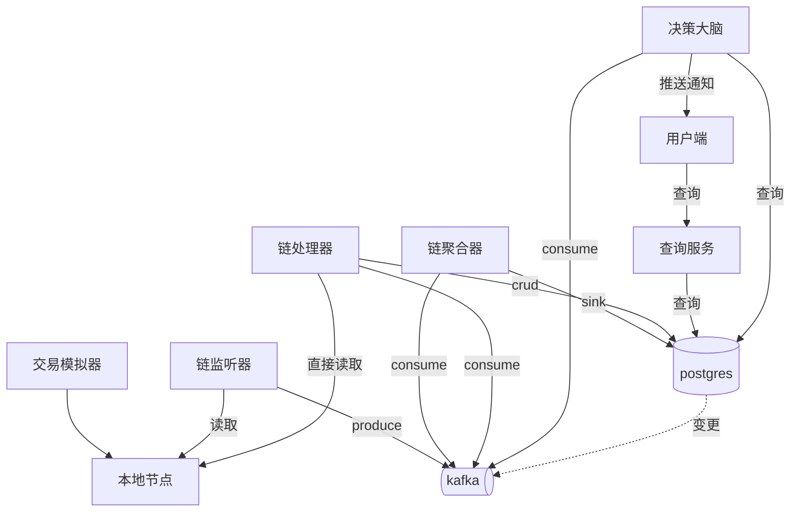
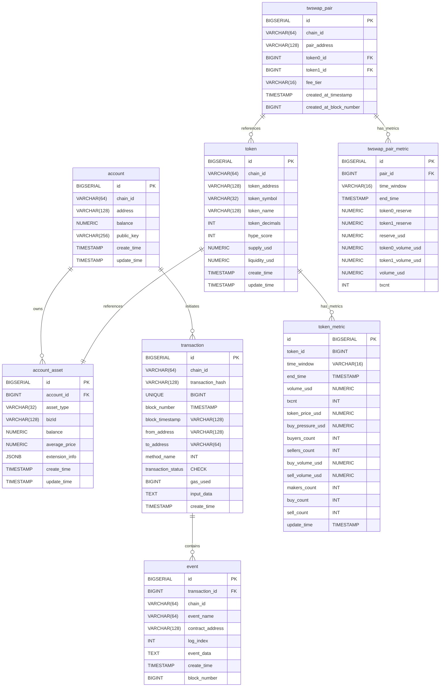
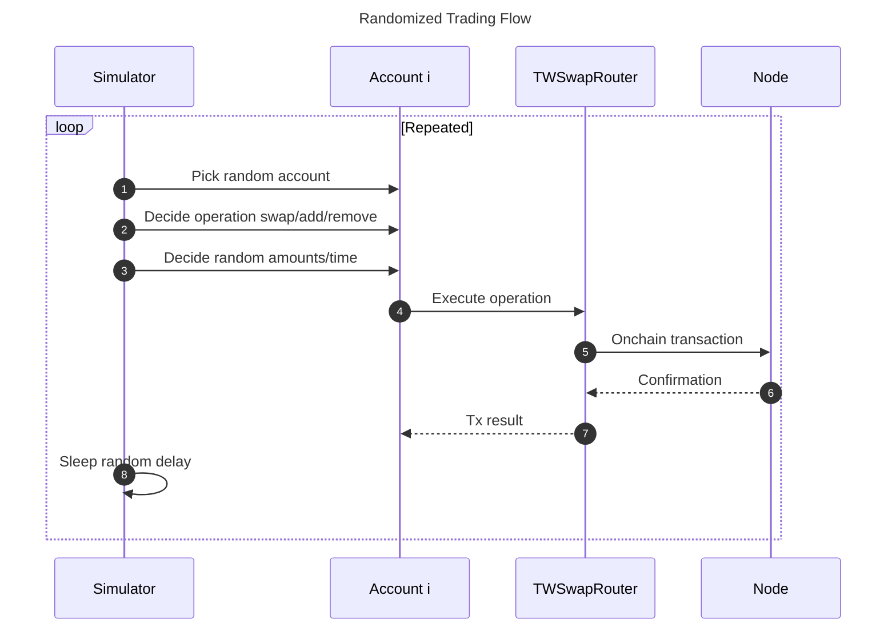
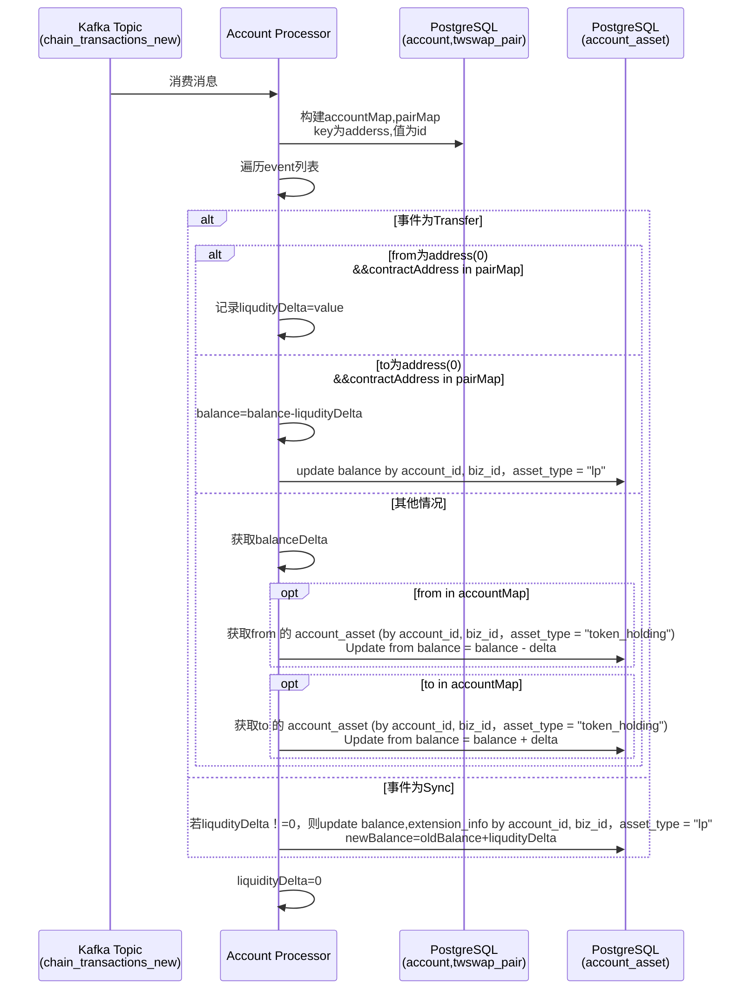
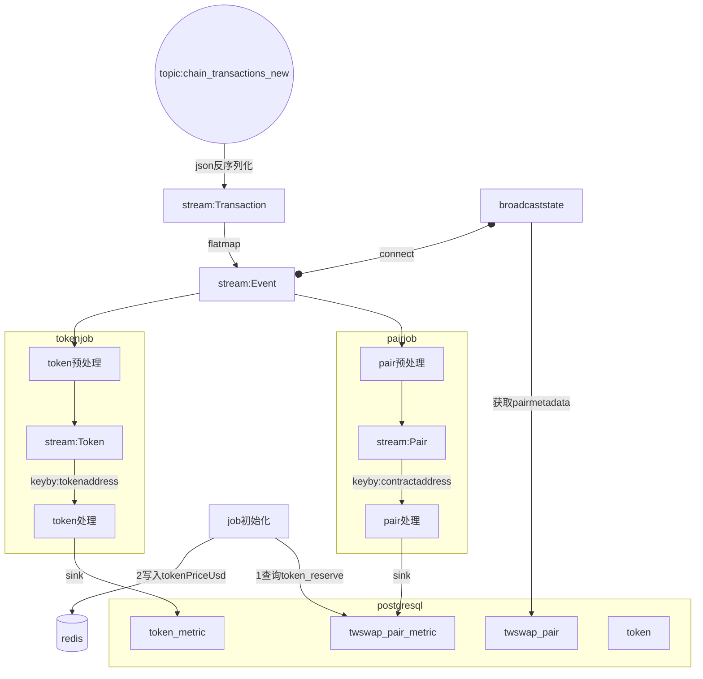
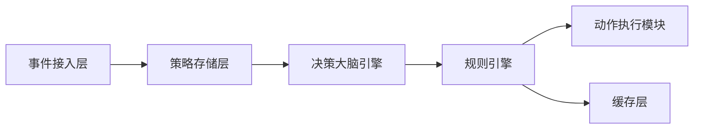
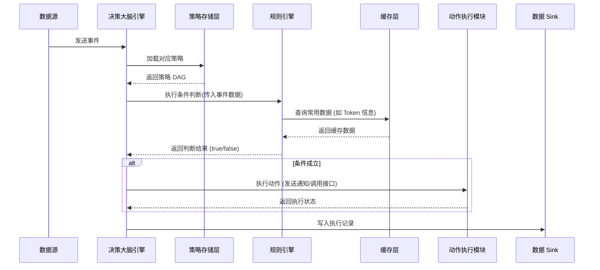
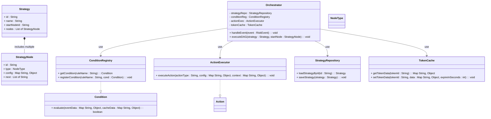

# 系统整体设计
项目名称：defi数据服务平台
项目目标：**通过链上数据分析帮助用户发现机会并规避风险**。
主要工作流：在本地节点模拟链上交易，监听节点数据，数据实时处理后进行大盘展示或事件通知，在后台通过决策大脑系统进行基于事件的监管
## 核心模块
1. **交易模拟器（simulator）**：在本地 Hardhat 节点中模拟多账户多场景的链上操作，为其他模块提供持续数据流。
2. **链监听器(listener)**：监听本地节点，将链原生数据格式转化成规定消息格式后，推送到消息队列。
3. **链处理器（processor）**：微服务，消费指定消息流，映射后写入数据库A（写库）
4. **链聚合器（aggregator）**：flink，消费指定消息流，进行窗口计算，sink到数据库A或消息队列
5. **CQRS同步器（synchronizer）**：使用CQRS模式将数据库A数据映射到数据库B（读库）
6. **查询器(uniQuery)**，为前端提供查询服务，以可视化方式呈现交易趋势、dex流动性等。
7. **决策大脑(brain)**：整个系统的调控中心，目前需求功能：接入事件（链上事件、用户事件），根据预设的决策大脑（DAG）进行节点调度
  
## 数据流图


## 数据模型

# 项目初始化
本项目尽量避免繁琐的crud,采用初始化的方式为数据库里的元数据赋值.初始化文件位置：localnode/scripts/initialize.js

account,account_asset,token,twswap_pair
## 项目约定
1.链合约部署信息位于 deployment.json 2.相同含义字段名称统一，比如只使用transactionHash而不使用txHash，如果外部依赖命名与系统约定不一致，转换成系统约定。3.数据库表结构位置 TableStructure.md 4.使用usdc作为唯一美元价格锚定，代币价格为与usdc交易对价格，交易对一定存在 5.使用项目根目录的docker-compose.yml作为唯一docker容器

## 指标唯一标准

**基本原则**：指标全名唯一，对应唯一当前值

### 指标命名规则

指标由以下四部分组成： `{scope}_{metrictype}_{unit}_{interval}`

### 各部分说明
- **scope**: 指标作用域，可由多部分组成，如eth_uni2_pair
- **metrictype**: 指标类型，如volume, liquidity, txcnt
- **interval**: 窗口时间，如20s, 1min, 1h，省略则代表总量
- **unit**: 单位，如usd，可根据共识省略，如次数
### 简写对照表
- uniswapv2 → uni2
- eth → ethereum
- transaction count→ txcnt

# 数据格式
## kafka格式
### topic:chain_transactions_new
```json
{    "transaction": {
      "type": "object",
      "properties": {
        "blockNumber": { "type": "integer" },
        "blockHash":   { "type": "string" },
        "timestamp":   { "type": "integer" },
        "transactionHash": { "type": "string" },
        "transactionIndex":{ "type": "integer" },
        "transactionStatus":      { "type": "string" },
        "gasUsed":     { "type": "integer" },
        "gasPrice":    { "type": "string" },
        "nonce":       { "type": "integer" },
        "fromAddress":        { "type": "string" },
        "toAddress":          { "type": "string" },
        "transactionValue":       { "type": "string" },
        "inputData":   { "type": "string" },
        "chainID":     { "type": "string" }
      },
      "required": ["blockNumber","transactionHash","fromAddress","toAddress","chainID"]
    },
    "events": {
      "type": "array",
      "items": {
        "type": "object",
        "properties": {
          "eventName": { "type": "string" },
          "contractAddress": { "type": "string" },
          "logIndex":  { "type": "integer" },
          "blockNumber": { "type": "integer" },
          "topics":    {
            "type": "array",
            "items": { "type": "string" }
          },
          "eventData":      { "type": "string" },
          "decodedArgs": { "type": "object" }
        },
        "required": ["eventName","contractAddress","logIndex"]
      }
    }
  }
}

```

# 交易模拟器
	1.	目标：在本地节点中模拟多账户、多 Token、多场景的交易，目前聚焦 Uniswap V2 （如添加或移除流动性、swap），为后续分析提供丰富数据。
	2.	主要组成
	•	Accounts：5 个本地账户，每个账户拥有足量测试 Token，并持续发起交易。
	•	Tokens：通过最小代理部署 5 个 MyERC20（WETH、USDC、DAI、TWI、WBTC）。给各账户 mint 大量代币。
	•	TWSwap：自实现的Uniswap V2（包含 Factory、Router、Pair），可处理 add/remove 流动性、swap。
	•	初始化脚本：部署合约、创建交易对并添加初始流动性，把合约地址写入deployment.json。
	•	模拟器循环：随机或脚本化地对 TWSwapRouter 发起多样化交易（addLiquidity、removeLiquidity、swap），生成持续事件流供后续处理。

## 流程图


# 链监听器
流程：
1. 使用 go-ethereum 的 ethclient 连接 http://127.0.0.1:8545，监听区块及拉取日志。
2. 解析链数据，聚合成transaction维度，发送到 Kafka（Topic: chain_transactions_new）。

# 链处理器
##
## 用户维度

### 主要功能

将链上的event数据按照用户维度和资产维度进行聚合，account表存放account基本信息，account_asset存放资产粒度信息，资产包括token与pair流动性。记录用户各token持仓与各pair流动性注入情况。记录和更新averagePrice用来衡量用户无偿损失大小。

### 时序图



**说明：**

当transfer代表mint lptoken时，只记录新mint的lptoken数，待transaction中的sync事件时进行balance与average_price统一更新

平均注入价格更新逻辑 ：（oldBalance*average_price+liqudityDelta*(reserve0/reserve1))/(liqudityDelta+oldBalance)，reserve0/reserve1从sync事件中获取
# 链聚合器
使用flink进行指标计算，java作为开发语言。从chain_transactions_new中解析出event列表，遍历列表进行处理sink到数据库。数据库结构在TableStucture.md. 需要对event中的reserve,amount数据除10的18次方进行换算。
## 流程图

## entity
PairMetric:
  pairId: Long        # 交易对 ID
  timeWindow: String  # 窗口时间 (20s, 1min, 5min, 30min)
  endTime: Timestamp  # 窗口结束时间
  token0Reserve: BigDecimal  # Token0 储备量
  token1Reserve: BigDecimal  # Token1 储备量
  reserveUsd: BigDecimal  # 交易对的总储备 USD 价值
  token0VolumeUsd: BigDecimal  # Token0 交易量 (USD)
  token1VolumeUsd: BigDecimal  # Token1 交易量 (USD)
  volumeUsd: BigDecimal  # 总交易量 (USD)
  txcnt: int  # 交易笔数
Token:
  tokenAddress: string  # Token 地址
  tokenId: Long         # Token ID
  tokenPriceUsd: BigDecimal  # Token 价格 (USD)
  buyOrSell: boolean  #  根据 amountIn 和 amountOut 判断是买还是卖。
  amount: BigDecimal  # 交易金额
  fromAddress: string  # 交易发起地址
TokenMetric:
  tokenId: Long         # Token ID
  timeWindow: String    # 窗口时间 (20s, 1min, 5min, 30min)
  endTime: Timestamp    # 窗口结束时间
  volumeUsd: BigDecimal  # 交易量 (USD)
  txcnt: Integer        # 交易笔数
  tokenPriceUsd: BigDecimal  # Token 价格 (USD)
  buyPressureUsd: BigDecimal  # 买入压力 (Buy Vol - Sell Vol)
  buyersCount: Integer  # 买家数量
  sellersCount: Integer  # 卖家数量
  buyVolumeUsd: BigDecimal  # 买入成交量 (USD)
  sellVolumeUsd: BigDecimal  # 卖出成交量 (USD)

stream:Transaction--flatmap -->stream:Event时将fromAddress写入Event方便后面处理获取。
## tokenPriceUsd
以twswap_pair表中各token 与usdc的pair的reserve比值为usd价格,usdc价格为1。reserve从twswap_pair_metric最新的数据获取
比如weth是token0,usdc是token1,weth的tokenPriceUsd为token1_reserve/token0_reserve，反之同理
redis key:tokenAddress value:tokenPriceUsd
## pair预处理
处理函数：BroadcastProcessFunction
从stream:Event获取pairaddress(取contractAddress),eventname,decodedArgs
filter: eventname=Sync||Swap||Mint||Burn
从broadcast state获取pairid,token0address,,token1address,
从redis获取token0PriceUsd，token1PriceUsd
## pair处理
keyBy:contractAddress
多个滚动时间窗口，窗口时间为20s,1min,5min,30min
### 指标计算
下面指标为窗口期累加值，初始值为0：
- token0_volume_usd
- token1_volume_usd
- volume_usd
- txcnt
下面指标在窗口内更新值：
- token0_reserve
- token1_reserve
- reserve_usd
## 事件处理逻辑
### Sync:
- 更新 token0_reserve, token1_reserve，如果token中包含usdc,则更新redis中pair另一种token的tokenPriceUsd
- 计算并更新 reserve_usd = token0_reserve * token0PriceUsd + token1_reserve * token1PriceUsd
- 增加 txcnt
### Swap:
- 更新 token0_volume_usd += amount0In * token0PriceUsd + amount0Out * token0PriceUsd
- 更新 token1_volume_usd 同理
- 增加 txcnt
### Mint/Burn:
- 仅增加 txcnt
## token预处理
处理函数：BroadcastProcessFunction
从stream:Event获取pairaddress(取contractAddress),eventname,decodedArgs
filter: eventname=Swap
从broadcast state获取pairid,token0address,token0PriceUsd,token1address,token1PriceUsd
flatmap成两个Token实体(token0与token1)

## token处理
keyBy:tokenAddress
多个滚动时间窗口，窗口时间为20s,1min,5min,30min
### 指标计算
所有指标为窗口期累加值，初始值为0：
- volume_usd amount*tokenPriceUsd
- buy_volume_usd+= buyOrSell==true?amount*tokenPriceUsd:0
- sell_volume_usd+=buyOrSell==false?amount*tokenPriceUsd:0
- buy_pressure_usd= buy_volume_usd-sell_volume_usd
- buyers_count = buyOrSell==true的txOriginAddress集合
- sellers_count =buyOrSell==false的txOriginAddress集合
- makers_count = buyers_count+sellers_count
- buy_count : if buyOrSell==true ,txcnt++
- sell_count: if buyOrSell==false,txcnt++
- txcnt++

# 决策大脑

决策大脑系统旨在对外部事件进行处理，根据预先配置的策略（以 DAG 形式定义）动态判断和执行动作。系统具有以下通用目标：
•	接收来自不同数据源（例如链上数据、实时聚合结果、增量数据库更新）的事件。
•	根据预设规则判断事件是否满足条件，并沿着策略 DAG 流程依次执行。
•	通过条件判断模块与动作执行模块，实现对风险、机会或通知等动作的自动化处理。
•	支持动态规则更新和缓存优化（例如 Redis 缓存常用数据），以提升实时响应能力。
**2. 整体架构**
系统主要分为以下模块：
•	**事件接入层**
负责从外部数据源（例如消息队列、增量数据库等）接收事件，并转换为内部统一格式。
•	**策略存储层**
保存策略配置（DAG），包括各节点（条件、动作、延时等）的定义与关联关系。
•	**规则引擎**
在条件节点中，根据预设规则及外部数据（可包含缓存数据）判断条件是否成立。
该模块通过接口定义和注册机制实现可扩展性和动态更新。
•	**决策大脑引擎**
接收到事件后，从策略存储中加载相应策略，通过遍历 DAG 按顺序执行条件、动作节点，管理状态及延时调度。
•	**动作执行模块**
根据条件判断结果，执行实际动作（例如发送通知、调用外部接口或写入下游系统）。
•	**缓存层**
对常用数据（如 Token 信息等）进行缓存，采用 Redis 等方案以加速规则引擎的查询，支持设置合理过期时间以确保数据实时性。
•	**数据 Sink**
将策略执行结果、事件聚合统计写入数据库或消息队列，供后续监控和决策使用。
下图描述了系统整体模块之间的数据流和交互关系。

**3. 数据流程**
1.	**事件接入**
外部系统（例如链聚合器、实时数据平台或数据库 CDC）将事件转换为统一格式后，通过消息队列送入决策大脑系统。
2.	**策略加载与执行**
决策大脑引擎接收到事件后，根据事件类型和其他上下文信息，从策略存储中加载对应策略（DAG），并开始遍历各节点。
3.	**条件判断**
对于条件节点，编排引擎调用规则引擎进行判断。规则引擎从缓存层（例如 Redis）获取常用数据，并根据预设规则（例如判断特定指标是否超过阈值）返回判断结果。
条件规则可以是简单的比较，也可以通过复合规则组合多个条件。
4.	**动作执行**
当条件判断成立时，决策大脑引擎进入动作节点，调用动作执行模块完成具体操作（例如发送用户通知或调用外部接口），并将执行状态反馈给编排引擎。
5.	**数据存储**
最终的策略执行结果和衍生事件写入数据库或消息队列，以便离线分析、监控与后续决策。
**4. 时序图**
下面的时序图展示了从事件输入到条件判断、动作执行及结果反馈的基本流程。

**说明**：
•	当决策大脑引擎接收到外部事件后，从策略存储加载策略 DAG，并通过规则引擎判断条件是否成立。
•	规则引擎在判断过程中可能访问缓存层（如 Redis）以加速查询。
•	若条件成立，则调用动作执行模块，最后将结果写入数据库或消息队列。
**5. 类图**
下面的类图展示了决策大脑系统中核心类及其关系。图中各模块之间接口清晰，支持动态扩展与缓存优化。

**说明**：
•	**Orchestrator** 是系统的核心入口，负责接收事件、加载策略、遍历 DAG 并调用条件和动作模块。
•	**Strategy** 和 **StrategyNode** 定义了策略的基本结构，DAG 节点可以为条件、动作、延时等不同类型。
•	**ConditionRegistry** 管理所有条件规则的实现，提供动态扩展能力。
•	**ActionExecutor** 负责实际动作执行，如发送通知或调用外部接口。
•	**TokenCache** 封装 Redis 操作，用于缓存 Token 表中的数据（如 chain_id、hype_score 等），并设置合理过期时间保证数据实时性。
•	**StrategyRepository** 负责加载和保存策略配置。
**6. 关键实现说明**
•	**数据接入**：
系统从外部数据源（例如 Postgres 增量数据、CDC 流）获取 token_metric 数据，用于计算买盘压力（buy_pressure）；同时从 token 表中获取 chain_id 和 hype_score。
这些数据可由实时计算系统（例如 Flink）聚合后写入数据库，或直接通过消息队列传递给决策大脑系统。
•	**缓存优化**：
Token 数据存入 Redis 缓存，TokenCache 提供查询接口。由于 hype_score 变化较快，设置TTL 1 分钟确保数据实时性。
•	**规则判断**：
条件节点调用 ConditionRegistry 注册的条件实现，例如判断：
•	token 表中 chain_id 是否等于 31337
•	token_metric 中 buy_pressure 是否大于 1000 USD
•	token 表中 hype_score 是否大于 70
当所有条件满足时，规则判断返回 true，触发后续动作。
•	**动作执行**：
若条件满足，决策大脑引擎通过 ActionExecutor 触发用户通知或其他动作。此处动作可以写入 Kafka 通知 Topic 或调用外部 API。
•	**策略流程**：
以 DAG 形式存储策略，每个节点具有类型和配置，支持条件判断、动作执行、延时等待等。整个流程在 Orchestrator 内部串联，实现动态化、可扩展的自动决策。
## 规则引擎
本规则引擎用于为决策大脑系统提供动态规则判断功能。系统通过加载外部 JSON 格式的配置文件，根据业务类型（bizType）筛选出一组 Condition（条件）规则，并并发调用每个 Condition 类的 Evaluate 方法，对传入的业务数据进行判断，返回命中的规则列表。该规则引擎分为以下几个核心模块：
	•	触发层：Orchestrator 加载配置文件，根据 bizType 筛选条件列表，并发调用各 Condition 的 Evaluate 方法；
	•	Condition 类：每个 Condition 包含多个 SubCondition 与一个 CompositeOperator（AND/OR），其 Evaluate 方法接收 bizType 与业务数据，返回判断结果 true/false；
	•	SubCondition 类：代表单个原子规则，定义一个 metric、一个运算符（>, <, =）和一个阈值；
	•	业务 Metric 获取类：针对每个 bizType，提供获取相关指标（metric）的方法，这些指标可以从数据库、缓存或直接从业务数据中获得；
	•	配置文件：以 JSON 文件保存所有条件规则配置，支持根据 bizType 筛选不同的规则组合。


# 查询器

## Overview

This document describes the GraphQL API endpoints for querying token analytics data, including token information, historical metrics, and time series data for analysis.

## API Endpoint

```
http://localhost:8091/query
```

GraphQL Playground (for development): `http://localhost:8091/`

## Schema Types

### Custom Scalars

```graphql
scalar DateTime  # ISO-8601 format, e.g., "2024-01-01T00:00:00Z"
scalar Decimal   # High-precision decimal numbers
```

### Token
```graphql
type Token {
  id: ID!
  chainId: String!
  chainName: String
  tokenAddress: String!
  tokenSymbol: String
  tokenName: String
  tokenDecimals: Int
  hypeScore: Int
  supplyUsd: Decimal         # FDV (Fully Diluted Valuation)
  liquidityUsd: Decimal      # Total liquidity estimation
  createTime: DateTime
  updateTime: DateTime
  currentPrice: Decimal      # Current token price in USD
  priceChange1h: Decimal     # Price change percentage in last hour
  volume1h: Decimal          # Trading volume in last hour
  buyPressure1h: Decimal     # Buy pressure in last hour
}
```

### TokenMetric
```graphql
type TokenMetric {
  id: ID!
  tokenId: ID!
  timeWindow: String         # e.g., "20s", "1min", "5min", "30min", "1h"
  endTime: DateTime
  volumeUsd: Decimal
  txcnt: Int
  tokenPriceUsd: Decimal
  buyPressureUsd: Decimal    # buy_volume - sell_volume
  buyersCount: Int          # Unique buyers count
  sellersCount: Int         # Unique sellers count
  buyVolumeUsd: Decimal
  sellVolumeUsd: Decimal
  makersCount: Int          # Total unique traders (buyers + sellers)
  buyCount: Int            # Number of buy transactions
  sellCount: Int           # Number of sell transactions
  updateTime: DateTime
  token: Token!             # Associated token information
}
```

### TokenStats
```graphql
type TokenStats {
  token: Token!
  currentPrice: Decimal!
  priceChange1h: Decimal!
  volume1h: Decimal!
  buyPressure1h: Decimal!
  lastUpdate: DateTime!
}
```

### TimeSeriesDataPoint
```graphql
type TimeSeriesDataPoint {
  timestamp: DateTime!
  tokenPriceUsd: Decimal
  buyVolumeUsd: Decimal
  sellVolumeUsd: Decimal
  volumeUsd: Decimal
  txcnt: Int
  makersCount: Int         # Total unique traders
  buyCount: Int           # Buy transactions count
  sellCount: Int          # Sell transactions count
  buyersCount: Int        # Unique buyers count
  sellersCount: Int       # Unique sellers count
}
```

## Available Queries

### 1. Token Stats Queries

#### Get Real-time Token Stats
```graphql
query TokenStats($tokenId: ID!) {
  tokenStats(tokenId: $tokenId) {
    token {
      tokenSymbol
      tokenName
      liquidityUsd
      supplyUsd
      hypeScore
    }
    currentPrice
    priceChange1h
    volume1h
    buyPressure1h
    lastUpdate
  }
}
```

#### Get Multiple Tokens Stats
```graphql
query TokensStats($tokenIds: [ID!]!) {
  tokensStats(tokenIds: $tokenIds) {
    token {
      tokenSymbol
      tokenName
      liquidityUsd
      supplyUsd
      hypeScore
    }
    currentPrice
    priceChange1h
    volume1h
    buyPressure1h
    lastUpdate
  }
}
```

### 2. Token Metrics by Window

#### Get Latest Window Metrics
```graphql
query TokenMetricsByWindow($tokenId: ID!, $timeWindow: String!) {
  tokenMetricsByWindow(tokenId: $tokenId, timeWindow: $timeWindow) {
    timeWindow
    endTime
    volumeUsd
    txcnt
    tokenPriceUsd
    buyPressureUsd
    buyersCount
    sellersCount
    makersCount
    buyCount
    sellCount
    token {
      tokenSymbol
      tokenName
    }
  }
}
```

### 3. Time Series Analytics

#### Get Detailed Time Series Data
```graphql
query TokenAnalytics(
  $tokenId: ID!
  $timeWindow: String!
  $from: DateTime!
  $to: DateTime!
) {
  tokenAnalytics(
    tokenId: $tokenId
    timeWindow: $timeWindow
    from: $from
    to: $to
  ) {
    token {
      tokenSymbol
      tokenName
    }
    timeWindow
    dataPoints {
      timestamp
      tokenPriceUsd
      buyVolumeUsd
      sellVolumeUsd
      volumeUsd
      txcnt
      makersCount
      buyCount
      sellCount
      buyersCount
      sellersCount
    }
  }
}
```

## Real-time Updates

### Token Stats Subscription
```graphql
subscription TokenStatsUpdated($tokenId: ID!) {
  tokenStatsUpdated(tokenId: $tokenId) {
    token {
      tokenSymbol
      tokenName
    }
    currentPrice
    priceChange1h
    volume1h
    buyPressure1h
    lastUpdate
  }
}
```

### Token Metrics Subscription
```graphql
subscription TokenMetricsUpdated($tokenId: ID!, $timeWindow: String!) {
  tokenMetricsUpdated(tokenId: $tokenId, timeWindow: $timeWindow) {
    timeWindow
    endTime
    volumeUsd
    txcnt
    tokenPriceUsd
    buyPressureUsd
    buyersCount
    sellersCount
    makersCount
    buyCount
    sellCount
  }
}
```