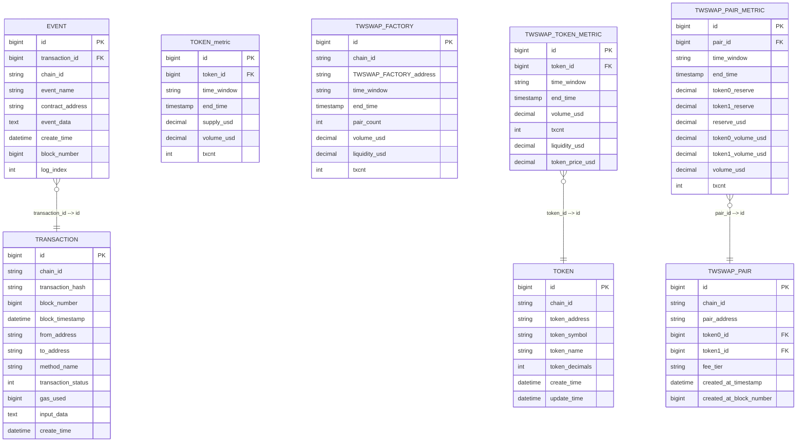

# 系统整体设计
项目名称：defi数据服务平台
项目目标：**通过链上数据分析帮助用户发现机会并规避风险**。
主要工作流：在本地节点模拟链上交易，监听节点数据，数据实时处理后进行大盘展示或事件通知，在后台通过策略编排系统进行基于事件的监管
## 核心模块
1. **交易模拟器（simulator）**：在本地 Hardhat 节点中模拟多账户多场景的链上操作，为其他模块提供持续数据流。
2. **链监听器(listener)**：监听本地节点，将链原生数据格式转化成规定消息格式后，推送到消息队列。
3. **链处理器（processor）**：微服务，消费指定消息流，映射后写入数据库A（写库）
4. **链聚合器（aggregator）**：flink，消费指定消息流，进行窗口计算，sink到数据库A或消息队列
5. **CQRS同步器（synchronizer）**：使用CQRS模式将数据库A数据映射到数据库B（读库）
6. **统一查询器(uniQuery)**，为前端提供统一查询服务，以可视化方式呈现交易趋势、流动性风险等。
7. **决策大脑(brain)**：整个系统的调控中心，目前需求功能：接入事件（链上事件、用户事件），根据预设的策略编排（DAG）进行节点调度
  
## 数据流图


## 项目约定
1.链合约部署信息位于 deployment.json 2.相同含义字段名称统一，比如只使用transactionHash而不使用txHash，如果外部依赖命名与系统约定不一致，转换成系统约定。3.数据库表结构位置 TableStructure.md 4.使用usdc作为唯一美元价格锚定，代币价格为与usdc交易对价格，交易对一定存在 5.使用项目根目录的docker-compose.yml作为唯一docker容器

## 指标唯一标准

**基本原则**：指标全名唯一，对应唯一当前值

### 指标命名规则

指标由以下四部分组成： `{scope}_{metrictype}_{unit}_{interval}`

### 各部分说明
- **scope**: 指标作用域，可由多部分组成，如eth_uni2_pair
- **metrictype**: 指标类型，如volume, liquidity, txcnt
- **interval**: 窗口时间，如20s, 1min, 1h，省略则代表总量
- **unit**: 单位，如usd，可根据共识省略，如次数
### 简写对照表
- uniswapv2 → uni2
- eth → ethereum
- transaction count→ txcnt

# 数据格式
## kafka格式
### topic:chain_transactions_new
```json
{    "transaction": {
      "type": "object",
      "properties": {
        "blockNumber": { "type": "integer" },
        "blockHash":   { "type": "string" },
        "timestamp":   { "type": "integer" },
        "transactionHash": { "type": "string" },
        "transactionIndex":{ "type": "integer" },
        "transactionStatus":      { "type": "string" },
        "gasUsed":     { "type": "integer" },
        "gasPrice":    { "type": "string" },
        "nonce":       { "type": "integer" },
        "fromAddress":        { "type": "string" },
        "toAddress":          { "type": "string" },
        "transactionValue":       { "type": "string" },
        "inputData":   { "type": "string" },
        "chainID":     { "type": "string" }
      },
      "required": ["blockNumber","transactionHash","fromAddress","toAddress","chainID"]
    },
    "events": {
      "type": "array",
      "items": {
        "type": "object",
        "properties": {
          "eventName": { "type": "string" },
          "contractAddress": { "type": "string" },
          "logIndex":  { "type": "integer" },
          "blockNumber": { "type": "integer" },
          "topics":    {
            "type": "array",
            "items": { "type": "string" }
          },
          "eventData":      { "type": "string" },
          "decodedArgs": { "type": "object" }
        },
        "required": ["eventName","contractAddress","logIndex"]
      }
    }
  }
}

```
## 数据库格式定义


# 交易模拟器
	1.	目标：在本地节点中模拟多账户、多 Token、多场景的交易，目前聚焦 Uniswap V2 （如添加或移除流动性、swap），为后续分析提供丰富数据。
	2.	主要组成
	•	Accounts：5 个本地账户，每个账户拥有足量测试 Token，并持续发起交易。
	•	Tokens：通过最小代理部署 5 个 MyERC20（WETH、USDC、DAI、TWI、WBTC）。给各账户 mint 大量代币。
	•	TWSwap：自实现的Uniswap V2（包含 Factory、Router、Pair），可处理 add/remove 流动性、swap。
	•	初始化脚本：部署合约、创建交易对并添加初始流动性，把合约地址写入deployment.json。
	•	模拟器循环：随机或脚本化地对 TWSwapRouter 发起多样化交易（addLiquidity、removeLiquidity、swap），生成持续事件流供后续处理。

## 流程图


# 链监听器
流程：
1. 使用 go-ethereum 的 ethclient 连接 http://127.0.0.1:8545，监听区块及拉取日志。
2. 解析链数据，聚合成transaction维度，发送到 Kafka（Topic: chain_transactions_new）。


