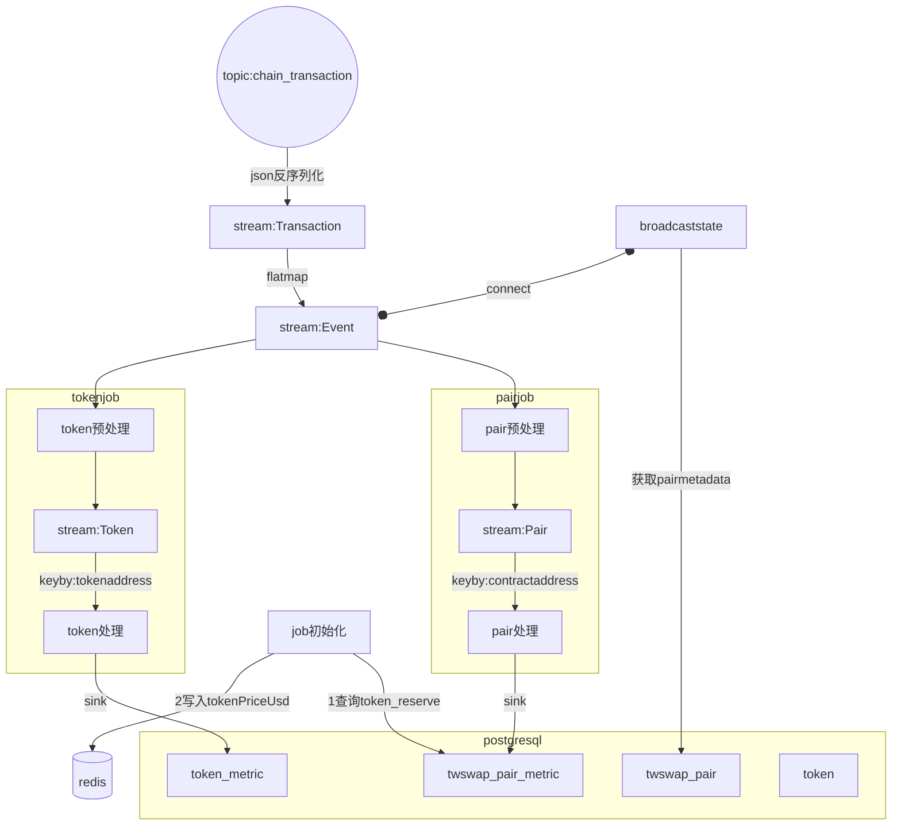

# 链聚合器
使用flink进行指标计算，java作为开发语言。从chain_transaction中解析出event列表，遍历列表进行处理sink到数据库。数据库结构在TableStucture.md. 需要对event中的reserve,amount数据除10的18次方进行换算。
## 流程图

## entity
PairMetric:
  pairId: Long        # 交易对 ID
  timeWindow: String  # 窗口时间 (20s, 1min, 5min, 30min)
  endTime: Timestamp  # 窗口结束时间
  token0Reserve: BigDecimal  # Token0 储备量
  token1Reserve: BigDecimal  # Token1 储备量
  reserveUsd: BigDecimal  # 交易对的总储备 USD 价值
  token0VolumeUsd: BigDecimal  # Token0 交易量 (USD)
  token1VolumeUsd: BigDecimal  # Token1 交易量 (USD)
  volumeUsd: BigDecimal  # 总交易量 (USD)
  txcnt: int  # 交易笔数
Token:
  tokenAddress: string  # Token 地址
  tokenId: Long         # Token ID
  tokenPriceUsd: BigDecimal  # Token 价格 (USD)
  buyOrSell: boolean  #  根据 amountIn 和 amountOut 判断是买还是卖。
  amount: BigDecimal  # 交易金额
  fromAddress: string  # 交易发起地址
TokenMetric:
  tokenId: Long         # Token ID
  timeWindow: String    # 窗口时间 (20s, 1min, 5min, 30min)
  endTime: Timestamp    # 窗口结束时间
  volumeUsd: BigDecimal  # 交易量 (USD)
  txcnt: Integer        # 交易笔数
  tokenPriceUsd: BigDecimal  # Token 价格 (USD)
  buyPressureUsd: BigDecimal  # 买入压力 (Buy Vol - Sell Vol)
  buyersCount: Integer  # 买家数量
  sellersCount: Integer  # 卖家数量
  buyVolumeUsd: BigDecimal  # 买入成交量 (USD)
  sellVolumeUsd: BigDecimal  # 卖出成交量 (USD)

stream:Transaction--flatmap -->stream:Event时将fromAddress写入Event方便后面处理获取。
## tokenPriceUsd
以twswap_pair表中各token 与usdc的pair的reserve比值为usd价格,usdc价格为1。reserve从twswap_pair_metric最新的数据获取
比如weth是token0,usdc是token1,weth的tokenPriceUsd为token1_reserve/token0_reserve，反之同理
redis key:tokenAddress value:tokenPriceUsd
## pair预处理
处理函数：BroadcastProcessFunction
从stream:Event获取pairaddress(取contractAddress),eventname,decodedArgs
filter: eventname=Sync||Swap||Mint||Burn
从broadcast state获取pairid,token0address,,token1address,
从redis获取token0PriceUsd，token1PriceUsd
## pair处理
keyBy:contractAddress
多个滚动时间窗口，窗口时间为20s,1min,5min,30min
### 指标计算
下面指标为窗口期累加值，初始值为0：
- token0_volume_usd
- token1_volume_usd
- volume_usd
- txcnt
下面指标在窗口内更新值：
- token0_reserve
- token1_reserve
- reserve_usd
## 事件处理逻辑
### Sync:
- 更新 token0_reserve, token1_reserve，如果token中包含usdc,则更新redis中pair另一种token的tokenPriceUsd
- 计算并更新 reserve_usd = token0_reserve * token0PriceUsd + token1_reserve * token1PriceUsd
- 增加 txcnt
### Swap:
- 更新 token0_volume_usd += amount0In * token0PriceUsd + amount0Out * token0PriceUsd
- 更新 token1_volume_usd 同理
- 增加 txcnt
### Mint/Burn:
- 仅增加 txcnt
## token预处理
处理函数：BroadcastProcessFunction
从stream:Event获取pairaddress(取contractAddress),eventname,decodedArgs
filter: eventname=Swap
从broadcast state获取pairid,token0address,token0PriceUsd,token1address,token1PriceUsd
flatmap成两个Token实体(token0与token1)

## token处理
keyBy:tokenAddress
多个滚动时间窗口，窗口时间为20s,1min,5min,30min
### 指标计算
所有指标为窗口期累加值，初始值为0：
- volume_usd amount*tokenPriceUsd
- buy_volume_usd+= buyOrSell==true?amount*tokenPriceUsd:0
- sell_volume_usd+=buyOrSell==false?amount*tokenPriceUsd:0
- buy_pressure_usd= buy_volume_usd-sell_volume_usd
- buyers_count = buyOrSell==true的txOriginAddress集合
- sellers_count =buyOrSell==false的txOriginAddress集合
- makers_count = buyers_count+sellers_count
- buy_count : if buyOrSell==true ,txcnt++
- sell_count: if buyOrSell==false,txcnt++
- txcnt++

