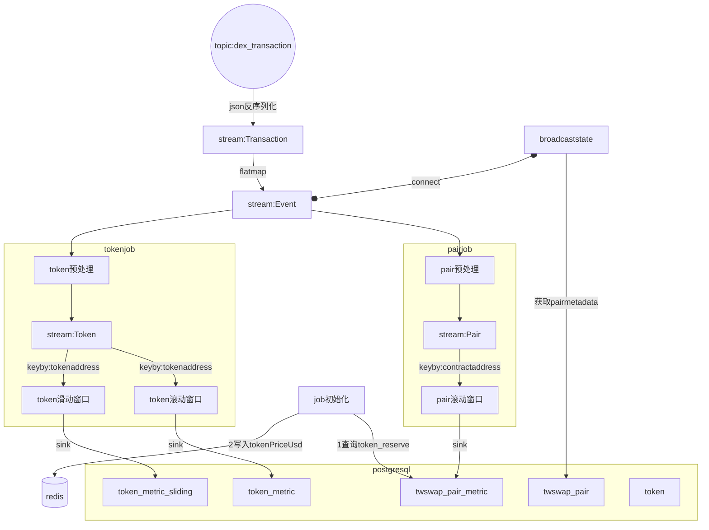
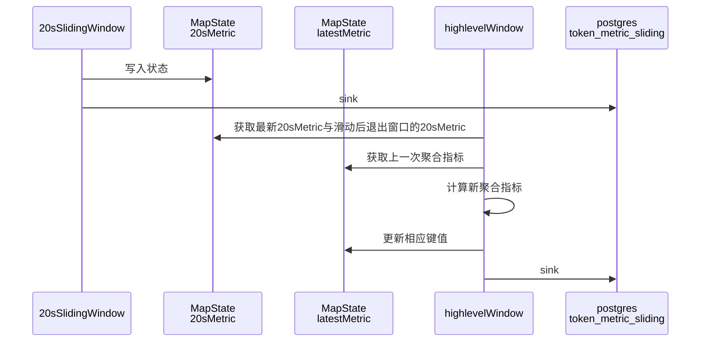

# 链聚合器
使用flink进行指标计算，java作为开发语言。从dex_transaction中解析出event列表，遍历列表进行处理sink到数据库。数据库结构在TableStucture.md. 需要对event中的reserve,amount数据除10的18次方进行换算。
## 流程图

stream:Transaction--flatmap -->stream:Event时将fromAddress写入Event方便后面处理获取。
## 层次化窗口处理
先计算 最小时间粒度（20s） 的窗口结果。
依次累积到 更大窗口，避免重复计算。

## tokenPriceUsd
以twswap_pair表中各token 与usdc的pair的reserve比值为usd价格,usdc价格为1。reserve从twswap_pair_metric最新的数据获取
比如weth是token0,usdc是token1,weth的tokenPriceUsd为token1_reserve/token0_reserve，反之同理
redis key:tokenAddress value:tokenPriceUsd
## pair预处理
处理函数：BroadcastProcessFunction
从stream:Event获取pairaddress(取contractAddress),eventname,decodedArgs
filter: eventname=Sync||Swap||Mint||Burn
从broadcast state获取pairid,token0address,,token1address,
从redis获取token0PriceUsd，token1PriceUsd
## pair处理
keyBy:contractAddress
多个滚动时间窗口，窗口时间为20s,1min,5min,30min
### 指标计算
下面指标为窗口期累加值，初始值为0：
- token0_volume_usd
- token1_volume_usd
- volume_usd
- txcnt
下面指标在窗口内更新值：
- token0_reserve
- token1_reserve
- reserve_usd
## 事件处理逻辑
### Sync:
- 更新 token0_reserve, token1_reserve，如果token中包含usdc,则更新redis中pair另一种token的tokenPriceUsd
- 计算并更新 reserve_usd = token0_reserve * token0PriceUsd + token1_reserve * token1PriceUsd
- 增加 txcnt
### Swap:
- 更新 token0_volume_usd += amount0In * token0PriceUsd + amount0Out * token0PriceUsd
- 更新 token1_volume_usd 同理
- 增加 txcnt
### Mint/Burn:
- 仅增加 txcnt
## token预处理
处理函数：BroadcastProcessFunction
从stream:Event获取pairaddress(取contractAddress),eventname,decodedArgs
filter: eventname=Swap
从broadcast state获取pairid,token0address,token0PriceUsd,token1address,token1PriceUsd
flatmap成两个Token实体(token0与token1)

## token处理
keyBy:tokenAddress
多个滚动时间窗口，窗口时间为20s,1min,5min,1h
### 指标计算
所有指标为窗口期累加值，初始值为0：
- volume_usd amount*tokenPriceUsd
- buy_volume_usd+= buyOrSell==true?amount*tokenPriceUsd:0
- sell_volume_usd+=buyOrSell==false?amount*tokenPriceUsd:0
- buy_pressure_usd= buy_volume_usd-sell_volume_usd
- - buy_count : if buyOrSell==true ,txcnt++
- sell_count: if buyOrSell==false,txcnt++
- txcnt++
<!-- - buyers_count = buyOrSell==true的txOriginAddress集合
- sellers_count =buyOrSell==false的txOriginAddress集合
- makers_count = buyers_count+sellers_count -->

### token滚动窗口
sink:表token_rolling_metric
使用层次化窗口处理
## token滑动窗口
sink:表token_metric
窗口统一以20s为滑动步长,20s窗口独立计算，其他以20s聚合结果进行增量聚合。

### 状态

MapState<Long,TokenMetricSLiding> 20sMetric  :key为时间戳，存储一小时内20s滑动窗口的历史值

MapState<String,TokenMetricSLiding> latestMetric : key为1min,5min,1h，存储相应滑动窗口上一次聚合值

### 增量聚合逻辑

1.获取最新20sMetric与滑动后退出窗口的20sMetric，如5分钟窗口需要获取 时间戳为五分钟前的指标

2.新指标通过对上一次聚合指标增加新值减去退出值来计算

3.采用增量聚合的指标。volume_usd，buy_volume_usd，sell_volume_usd，buy_count，sell_count