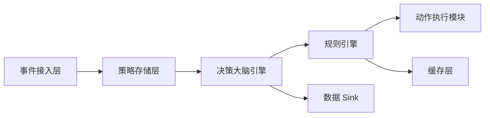
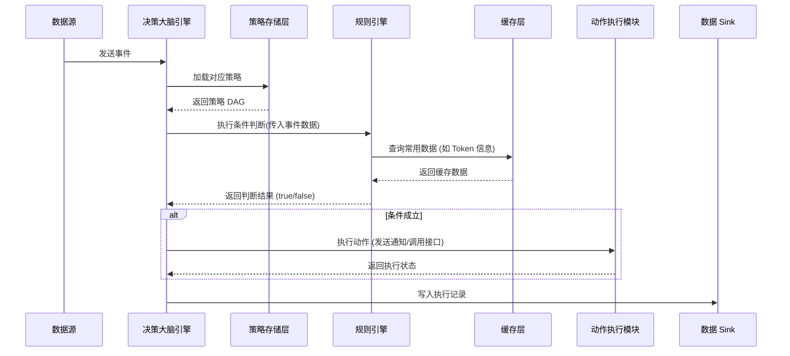
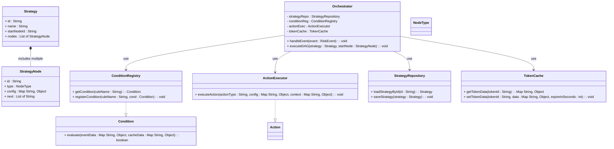

# 决策大脑

决策大脑系统旨在对外部事件进行处理，根据预先配置的策略（以 DAG 形式定义）动态判断和执行动作。系统具有以下通用目标：

•	接收来自不同数据源（例如链上数据、实时聚合结果、增量数据库更新）的事件。

•	根据预设规则判断事件是否满足条件，并沿着策略 DAG 流程依次执行。

•	通过条件判断模块与动作执行模块，实现对风险、机会或通知等动作的自动化处理。

•	支持动态规则更新和缓存优化（例如 Redis 缓存常用数据），以提升实时响应能力。

**2. 整体架构**

系统主要分为以下模块：

•	**事件接入层**

负责从外部数据源（例如消息队列、增量数据库等）接收事件，并转换为内部统一格式。

•	**策略存储层**

保存策略配置（DAG），包括各节点（条件、动作、延时等）的定义与关联关系。

•	**规则引擎**

在条件节点中，根据预设规则及外部数据（可包含缓存数据）判断条件是否成立。

该模块通过接口定义和注册机制实现可扩展性和动态更新。

•	**决策大脑引擎**

接收到事件后，从策略存储中加载相应策略，通过遍历 DAG 按顺序执行条件、动作节点，管理状态及延时调度。

•	**动作执行模块**

根据条件判断结果，执行实际动作（例如发送通知、调用外部接口或写入下游系统）。

•	**缓存层**

对常用数据（如 Token 信息等）进行缓存，采用 Redis 等方案以加速规则引擎的查询，支持设置合理过期时间以确保数据实时性。

•	**数据 Sink**

将策略执行结果、事件聚合统计写入数据库或消息队列，供后续监控和决策使用。

下图描述了系统整体模块之间的数据流和交互关系。

**3. 数据流程**

1.	**事件接入**

外部系统（例如链聚合器、实时数据平台或数据库 CDC）将事件转换为统一格式后，通过消息队列送入决策大脑系统。

2.	**策略加载与执行**

决策大脑引擎接收到事件后，根据事件类型和其他上下文信息，从策略存储中加载对应策略（DAG），并开始遍历各节点。

3.	**条件判断**

对于条件节点，编排引擎调用规则引擎进行判断。规则引擎从缓存层（例如 Redis）获取常用数据，并根据预设规则（例如判断特定指标是否超过阈值）返回判断结果。

条件规则可以是简单的比较，也可以通过复合规则组合多个条件。

4.	**动作执行**

当条件判断成立时，决策大脑引擎进入动作节点，调用动作执行模块完成具体操作（例如发送用户通知或调用外部接口），并将执行状态反馈给编排引擎。

5.	**数据存储**

最终的策略执行结果和衍生事件写入数据库或消息队列，以便离线分析、监控与后续决策。

**4. 时序图**

下面的时序图展示了从事件输入到条件判断、动作执行及结果反馈的基本流程。

**说明**：

•	当决策大脑引擎接收到外部事件后，从策略存储加载策略 DAG，并通过规则引擎判断条件是否成立。

•	规则引擎在判断过程中可能访问缓存层（如 Redis）以加速查询。

•	若条件成立，则调用动作执行模块，最后将结果写入数据库或消息队列。

**5. 类图**

下面的类图展示了决策大脑系统中核心类及其关系。图中各模块之间接口清晰，支持动态扩展与缓存优化。

**说明**：

•	**Orchestrator** 是系统的核心入口，负责接收事件、加载策略、遍历 DAG 并调用条件和动作模块。

•	**Strategy** 和 **StrategyNode** 定义了策略的基本结构，DAG 节点可以为条件、动作、延时等不同类型。

•	**ConditionRegistry** 管理所有条件规则的实现，提供动态扩展能力。

•	**ActionExecutor** 负责实际动作执行，如发送通知或调用外部接口。

•	**TokenCache** 封装 Redis 操作，用于缓存 Token 表中的数据（如 chain_id、hype_score 等），并设置合理过期时间保证数据实时性。

•	**StrategyRepository** 负责加载和保存策略配置。

**6. 关键实现说明**

•	**数据接入**：

系统从外部数据源（例如 Postgres 增量数据、CDC 流）获取 token_metric 数据，用于计算买盘压力（buy_pressure）；同时从 token 表中获取 chain_id 和 hype_score。

这些数据可由实时计算系统（例如 Flink）聚合后写入数据库，或直接通过消息队列传递给决策大脑系统。

•	**缓存优化**：

Token 数据存入 Redis 缓存，TokenCache 提供查询接口。由于 hype_score 变化较快，设置TTL 1 分钟确保数据实时性。

•	**规则判断**：

条件节点调用 ConditionRegistry 注册的条件实现，例如判断：

•	token 表中 chain_id 是否等于 31337

•	token_metric 中 buy_pressure 是否大于 1000 USD

•	token 表中 hype_score 是否大于 70

当所有条件满足时，规则判断返回 true，触发后续动作。

•	**动作执行**：

若条件满足，决策大脑引擎通过 ActionExecutor 触发用户通知或其他动作。此处动作可以写入 Kafka 通知 Topic 或调用外部 API。

•	**策略流程**：

以 DAG 形式存储策略，每个节点具有类型和配置，支持条件判断、动作执行、延时等待等。整个流程在 Orchestrator 内部串联，实现动态化、可扩展的自动决策。

## 规则引擎
本规则引擎用于为决策大脑系统提供动态规则判断功能。系统通过加载外部 JSON 格式的配置文件，根据业务类型（bizType）筛选出一组 Condition（条件）规则，并并发调用每个 Condition 类的 Evaluate 方法，对传入的业务数据进行判断，返回命中的规则列表。该规则引擎分为以下几个核心模块：
	•	触发层：Orchestrator 加载配置文件，根据 bizType 筛选条件列表，并发调用各 Condition 的 Evaluate 方法；
	•	Condition 类：每个 Condition 包含多个 SubCondition 与一个 CompositeOperator（AND/OR），其 Evaluate 方法接收 bizType 与业务数据，返回判断结果 true/false；
	•	SubCondition 类：代表单个原子规则，定义一个 metric、一个运算符（>, <, =）和一个阈值；
	•	业务 Metric 获取类：针对每个 bizType，提供获取相关指标（metric）的方法，这些指标可以从数据库、缓存或直接从业务数据中获得；
	•	配置文件：以 JSON 文件保存所有条件规则配置，支持根据 bizType 筛选不同的规则组合。