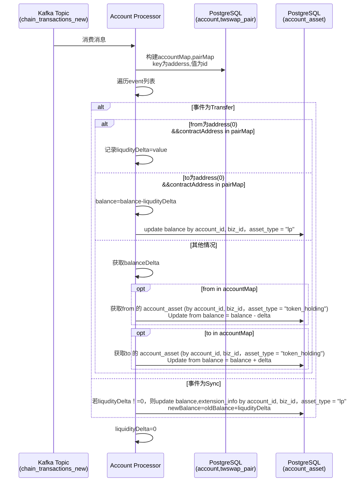

# 链处理器
##
## 用户维度

### 主要功能

将链上的event数据按照用户维度和资产维度进行聚合，account表存放account基本信息，account_asset存放资产粒度信息，资产包括token与pair流动性。记录用户各token持仓与各pair流动性注入情况。记录和更新averagePrice用来衡量用户无偿损失大小。

### 时序图

```mermaid
sequenceDiagram
    participant Topic as Kafka Topic<br>(chain_transactions_new)
    participant Processor as Account Processor
    participant DB_Account as PostgreSQL<br>(account,twswap_pair)
    participant DB_Asset as PostgreSQL<br>(account_asset)
    Topic ->> Processor: 消费消息
    Processor ->> DB_Account: 构建accountMap,pairMap<br>key为adderss,值为id
    Processor ->> Processor:遍历event列表
    alt 事件为Transfer
        alt from为address(0)<br>&&contractAddress in pairMap
        Processor ->> Processor:记录liqudityDelta=value

        else to为address(0)<br>&&contractAddress in pairMap
        Processor ->> Processor:balance=balance-liqudityDelta
        Processor ->> DB_Asset: update balance by account_id, biz_id，asset_type = "lp"
        else 其他情况
        Processor ->> Processor:获取balanceDelta 
        opt from in accountMap
            Processor ->> DB_Asset:获取from 的 account_asset (by account_id, biz_id，asset_type = "token_holding")<br>Update from balance = balance - delta
        end
        opt  to in accountMap
            Processor ->> DB_Asset: 获取to 的 account_asset (by account_id, biz_id，asset_type = "token_holding")<br>Update from balance = balance + delta
        end
    end
    else 事件为Sync
        Processor ->> DB_Asset:若liqudityDelta！=0，则update balance,extension_info by account_id, biz_id，asset_type = "lp"<br>newBalance=oldBalance+liqudityDelta
    end
     Processor ->> Processor:liquidityDelta=0
```