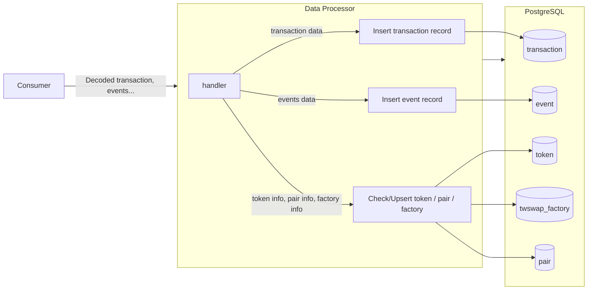

# 数据处理与数据库写入
启动时自动从deployment.json初始化pair,token数据

```mermaid
flowchart LR
    subgraph Processor["Data Processor"]
      P1[handler]
      P2[Check/Upsert token / pair / factory]
      P3[Insert transaction record]
      P4[Insert event record]
    end

    subgraph PostgreSQL["PostgreSQL"]
      T[(transaction)]
      E[(event)]
      Tk[(token)]
      Fac[(twswap_factory)]
      Par[(pair)]
    end
    Consumer -->|Decoded transaction, events...| Processor
    Processor --> PostgreSQL
    P1 -->|token info, pair info, factory info| P2
    P2 --> Tk & Fac & Par
    P1 -->|transaction data| P3
    P3 --> T
    P1 -->|events data| P4
    P4 --> E
```
